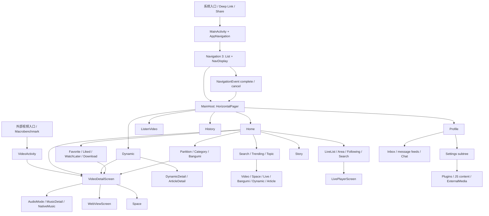

# BiliPai 全局 UI 流畅度静态审查

> 审查类型：全仓静态性能审查；未运行 APK、真机、Macrobenchmark 或 Perfetto。
> 代码快照：`main@e4f188deca87f6610e217a9b0ea4fd7ce6da1ee4`（`fix(space): correct card highlight animation import`）。
> 快照时间：`2026-07-26T18:00:17+08:00`；开始审查时工作树干净。
> 结论边界：本报告确认代码机制和执行位置；只有动态数据才能证明某设备上的实际帧耗时。历史性能文件仅作背景，不作为当前代码一定掉帧的证据。

## 1. 执行摘要

### 1.1 结论

BiliPai 是以 Kotlin、Jetpack Compose 和 Navigation 3 为主体的 Android 应用，核心交互大量使用 Lazy 列表/Grid、Pager、自定义拖拽、共享元素、Haze/Backdrop 模糊和 Media3。项目已经具备 R8、资源压缩、Baseline Profile、Startup Profile、Macrobenchmark、Compose runtime tracing 以及视频预测性返回完成/取消基准，主首页、动态流和评论列表也存在稳定 `key`/`contentType`、列表状态保存和延迟读取的正向实现，不能概括为“全局列表实现不佳”。

整体静态风险评为**中高**。主要风险集中在四类真实调用链：

1. 首页、主 Tab、设置中的通用液态分段控件及部分 Pager/下拉刷新在组合期读取帧级 State，并存在跨阶段回写。
2. 冷启动缓存缺失时同步等待 DataStore，所谓“首个可交互后”的插件/下载初始化仍由主线程 IdleHandler 执行文件读取和 JSON 解析，可能与首页首滚重叠。
3. 视频、直播、番剧、离线播放器离开页面时在主线程释放 Media3；`Handler.post` 只是排队到主线程，并不等于等导航转场结束。
4. 直播消息进入主线程后逐条栅格化 Bitmap、刷新整批数据，直播聊天还会逐条头删与启动滚动动画；这些机制严重度高，但不列入当前首页/设置优先落地批次。

未发现能仅凭当前静态证据定为 P0 的问题。共记录 **12 个合并根因：P0 0、P1 4、P2 7、P3 1**。

| 严重度 | 数量 | 判定口径 |
|---|---:|---|
| P0 | 0 | 未发现已能证明会造成严重卡顿、ANR、功能异常或返回栈错误的当前机制 |
| P1 | 4 | 高频直播、拖拽/动画或核心播放器退出路径上的确定性额外工作 |
| P2 | 7 | 缓存缺失、特定媒体内容、定制启动图、WebView、模态返回或中低端设备风险 |
| P3 | 1 | 性能报告、基准覆盖和线上帧监控基础设施缺口 |

### 1.2 面向首页、设置与高频路径的 10 项落地优先级

下表按“用户覆盖面 × 触发频率 × 静态风险 × 实施依赖”排序，不等同于严重度排序。当前先处理首页、启动、主 Tab、设置和常用返回路径；直播问题保留其 P1/P2 结论与验证方案，但暂缓实施。

| 排名 | ID | 问题 | 严重度 | 主要阶段 |
|---:|---|---|---|---|
| 1 | AUD-04 | 首页/主 Tab/设置共用控件、下拉刷新和 Pager 在组合期读取帧级 State，部分路径反向写 State | P1 | 组合、布局、绘制 |
| 2 | AUD-07 | “首个可交互后”插件/下载恢复仍在主线程 IdleHandler 做磁盘与 JSON 工作 | P2 | 启动、首页首滚、主线程/IO |
| 3 | AUD-06 | 启动偏好缓存缺失时组合路径 `runBlocking(IO)` 等待 DataStore | P2 | 启动、主线程 |
| 4 | AUD-09 | 首页/动态/搜索/外观设置中的 Coil 淡入和 request churn 需要重点收敛 | P2 | 分配、解码、绘制 |
| 5 | AUD-08 | 自定义启动图探测/背景/海报重复请求并叠加大面积动态 blur | P2 | 解码、内存、绘制/GPU |
| 6 | AUD-05 | 高频视频退出时主线程同步 `player.release()` 与返回转场竞争 | P1 | 主线程、导航、媒体 |
| 7 | AUD-11 | 高频模态层只处理最终返回，缺少预测性完成/取消进度路径 | P2 | 导航、动画、状态 |
| 8 | AUD-10 | WebView 无显式释放，顶部/系统返回忽略网页历史 | P2 | 内存、导航、返回 |
| 9 | AUD-01 | 直播弹幕逐条在主线程创建 Bitmap，刷新时复制/排序/整批 `setData`（暂缓） | P1 | 主线程、分配、绘制/GPU |
| 10 | AUD-03 | 直播聊天逐条头删、无稳定 key、逐条 `animateScrollToItem`（暂缓） | P1 | 组合、布局、主线程 |

当前前三个落地方向是：先把 MainHost/Home/BottomBarSettings 的帧级 State 读取下沉到 layout/draw 并删除跨阶段回写；随后移除启动组合路径的 DataStore 同步等待；最后把插件/下载恢复的文件与 JSON 工作移出主线程，并以真实首个稳定帧信号调度。首页图片策略作为紧随其后的第四项。设置主列表本身未形成高置信静态问题，因此只针对 BottomBarSettings、AppearanceSettings、PluginsSettings 和启动偏好链路修改，避免无证据重写。

### 1.3 范围和覆盖基线

| 范围 | 静态覆盖 |
|---|---|
| `app` | `app/src/main/java` 的 1,032 个 Kotlin 主源码文件、资源、Manifest、Gradle、单元/仪器测试；主运行时文件清单（Java/Kotlin 目录加资源）1,349 个 |
| `baselineprofile` | 9 个模块文件；Profile 生成器、启动、首页、底部 Pager、视频详情和设置返回基准 |
| `settings-core` | 3 个文件；播放速度偏好策略，无 UI 运行时热路径 |
| `network-core` | 4 个文件；网络回退和首页匿名化策略，无 UI 组件 |
| `plugin-sdk` | 7 个文件；推荐、弹幕、播放器插件契约，无 UI 实现 |
| 页面/导航 | 61 个 `BiliPaiNavKey`；59 个显式 `entry<T>` 加 2 个由 fallback 覆盖的 key；74 个名称以 `Screen/Page` 结尾的 `@Composable` 声明 |
| Activity | Manifest 中 14 个 `<activity>`、35 个 `<activity-alias>`；实际独立 UI 壳为 `MainActivity` 与 `VideoActivity`，另 12 个启动图子类复用 `MainActivity` |

运行时范围排除了 `examples/plugins` 示例、历史文档、`docs/perf/raw` 采样、测试源码，以及根目录 `commonMain/dev/chrisbanes/haze`、`androidMain/dev/chrisbanes/haze` 中未被 Gradle source set 接入的源码快照。它们被核对但不用于证明当前运行时问题。

## 2. 项目 UI 和导航架构概览

### 2.1 模块职责与技术栈

| 层 | 实现与版本 | 性能边界 |
|---|---|---|
| 构建 | AGP 8.13.2、Kotlin 2.4.0、Java 21；compile SDK 37、target 35、min 26 | Release 开启 R8 与资源压缩；`smooth` 不压缩，仅作接近发布语义的本地变体 |
| Compose | Compose BOM 2026.03.01、Material3 1.5.0-alpha18、Activity Compose 1.13.0、Miuix 0.9.3 | Kotlin 2.4 已处于 strong skipping 默认开启范围；不能仅因参数“不稳定”报错，需检查实例 churn 与实际跳过条件 |
| 导航 | Navigation 3 runtime 1.1.4、Miuix Navigation3 UI、NavigationEvent 1.1.2；本地 vendored `androidx.navigationevent.compose` | `List<BiliPaiNavKey>` 自持栈、`NavDisplay`/SinglePaneScene、entry metadata 转场、NavigationEvent 预测性返回 |
| 图片/媒体 | Coil 2.7.0、Media3 1.10.0、Lottie 6.7.1 | 全局 ImageLoader、视频/直播/番剧/离线/外部媒体播放器、多套弹幕渲染 |
| 视觉效果 | Haze 1.7.2、Backdrop 2.0.0-alpha03、Compose blur/graphicsLayer/shared element | 成本横跨 composition、layout、draw、RenderThread/GPU；不能把“使用 blur/动画”本身视作问题 |
| 状态 | ViewModel、StateFlow/SharedFlow、DataStore、`collectAsStateWithLifecycle` | 主 UI 共有 542 个生命周期感知收集调用点；重点是高频源、收集范围和 Effect 生命周期，而非数量本身 |
| 性能设施 | Baseline Profile、Startup Profile、Macrobenchmark 1.4.1、FrameTimingMetric、StartupTimingMetric、runtime tracing、Perfetto tracing | 已覆盖核心首页/视频，但缺少部分高风险页面和持续帧监控 |

Android 官方说明 Compose 帧可分为 composition、layout、draw 三阶段，延迟快速 State 的读取可跳过不必要阶段；Lazy 项稳定 key 可避免移动时把未变 item 当成新 item；backwards write 会再次安排重组。以上分别作为 AUD-03/AUD-04 的判据，而非通用猜测：[Compose 性能实践](https://developer.android.com/develop/ui/compose/performance/bestpractices)、[Compose 阶段](https://developer.android.com/develop/ui/compose/performance/phases)。Kotlin 2.0.20 起 strong skipping 默认开启，非稳定参数使用实例相等比较，因此本报告未把“参数类型不稳定”单独列为问题：[Strong skipping](https://developer.android.com/develop/ui/compose/performance/stability/strongskipping)。

### 2.2 页面、滚动与状态结构

`AppNavigation` 在 `MainActivity` 内维护 Navigation 3 栈；根 `MainHost` 使用 `HorizontalPager` 承载可配置的首页、动态、听视频、历史、我的等主 Tab，并用 `SaveableStateHolder` 保留页内状态。二级页面通过 `BiliPaiNavKey` 入栈；`VideoActivity` 是用于外部/基准入口的独立视频壳。设置在平板上另有单/双栏 shell，但仍由相同 NavKey 和回退策略管理。

静态调用点基线（仅统计主源码中以调用形式出现的符号）如下：

| 容器/API | 调用点 | 容器/API | 调用点 |
|---|---:|---|---:|
| `LazyColumn` | 83 | `LazyRow` | 35 |
| `LazyVerticalGrid` | 26 | `LazyHorizontalGrid` | 0 |
| `HorizontalPager` | 18 | `VerticalPager` | 1 |
| `.verticalScroll` | 29 | `.horizontalScroll` | 27 |
| `.nestedScroll` | 10 | `.pointerInput` | 71 |
| `AsyncImage` | 193 | `rememberAsyncImagePainter` | 2 |
| `LaunchedEffect` | 488 | `DisposableEffect` | 95 |

重点列表不是机械地“缺 key”：首页分类、动态流、首页 skeleton、主要评论列表已经使用稳定 key，部分异构热列表也设置 `contentType`。真正进入问题清单的是直播聊天“每次头删导致所有位置移动 + 无 key”的完整链路。类似地，`snapshotFlow`、`derivedStateOf` 和动画只有在读写频率、重组范围或工作量能串起来时才被判定。

### 2.3 导航、动画与返回体系

- `pushBiliPaiNavKey` 会抑制与当前栈顶完全相等的 key；设置分类还会同层 replace。因此本报告没有把“可能重复导航”当成已确认问题。
- `BiliPaiNavEntryProvider` 给普通 push/pop 写 entry metadata。代码明确记录优先级为“转场 entry metadata > Scene metadata > NavDisplay 默认值”；预测性 pop 刻意不写 entry metadata，回落到全局 `NavDisplay.predictivePopTransitionSpec`。
- `BiliPaiNavDisplayHost` 用 `NavigationBackHandler` 处理完成/取消，取消时恢复视频卡片和背景 blur clock；`MainHostTabBackHandler` 在非首页主 Tab 上把返回落到首页。
- 视频详情、本地全屏播放器和图片预览已接入 NavigationEvent；若只用普通 `BackHandler` 的模态层则只处理最终返回，不消费进度，见 AUD-11。
- Manifest 在 application 级设置 `android:enableOnBackInvokedCallback="true"`。官方建议需要自定义跟手动画时使用 `PredictiveBackHandler`/进度 Flow，并在取消时恢复 UI；多个 callback 采用后注册且 enabled 的回调优先：[预测性返回](https://developer.android.com/guide/navigation/custom-back/predictive-back-gesture)。

### 2.4 图片、播放器与启动边界

Coil 全局缓存为内存 10%、磁盘 150MB，复用共享 OkHttp，且允许 RGB_565；这些是正向配置。但全局 `crossfade(true)` 会让未显式覆盖的请求都淡入，部分动态/列表 item 还在组合体内新建 `ImageRequest`。图片是否过大不能从 URL 推断；AUD-08 只对未提供尺寸解析器的启动图 probe 作出具体判断。官方文档指出图片加载器若不能在请求前推断目标边界会回退到原图，并建议显式尺寸或 aspect ratio：[Bitmap 优化](https://developer.android.com/develop/ui/compose/graphics/images/optimization)。

播放器所有权分散在视频、直播、番剧、离线、竖屏 feed 与插件外部媒体页面。当前多数页面会在 `DisposableEffect.onDispose` 释放 Media3，但释放时机未和 Navigation 3 transition completion 统一；这保证了回收，却可能把重工作放进返回帧。

## 3. 问题清单

### AUD-01 直播弹幕逐条在主线程创建 Bitmap，批刷新又复制、排序并重置控制器

- **严重程度**：P1
- **结论级别**：静态确认（工作机制与执行线程可确认；单帧耗时仍需真机量化）
- **问题类型**：主线程 / 内存分配 / 绘制 / 媒体
- **涉及文件**：`app/src/main/java/com/android/purebilibili/feature/video/ui/overlay/LiveDanmakuOverlay.kt:108-205`、`app/src/main/java/com/android/purebilibili/feature/video/ui/overlay/LiveDanmakuOverlay.kt:240-271`；`app/src/main/java/com/android/purebilibili/feature/video/danmaku/Probe.kt:25-100`、`app/src/main/java/com/android/purebilibili/feature/video/danmaku/Probe.kt:148-218`
- **涉及位置**：`LiveDanmakuOverlay`、`createDanmakuData`、`createBitmapDanmaku`、`drawContent`
- **代码证据**：`LaunchedEffect(danmakuFlow)` 的 collector 直接调用 `createDanmakuData`；该函数最终 `Bitmap.createBitmap(..., ARGB_8888)`、创建 Canvas、测量并描边/填充文本。即使调用方传入 `enableEmoticon = false`，`drawContent` 仍先执行 `val imageLoader = ImageLoader(context)`。另一个 100ms 循环在数据变化时 `sortBy`、`toList()`，再 `pause → setData(snapshot) → start → invalidateView`。
- **触发场景**：进入任意直播间并开启弹幕；每条实时弹幕触发一次栅格化，突发消息随后在批刷新 tick 合并。
- **性能影响**：每条消息至少分配一个 ARGB_8888 Bitmap、Paint/Segment/Canvas 相关对象并上传纹理；高峰时与视频解码、Compose 直播聊天和控制器整批刷新共享主线程/RenderThread。影响 composition 之外的主线程业务、Bitmap heap、draw/GPU upload 和 GC。
- **影响范围**：所有 `LivePlayerScreen` 直播间；消息速率越高、设备内存/CPU/GPU 越弱越明显。
- **优化建议**：对 `enableEmoticon = false` 走引擎原生文字弹幕或轻量文本数据，完全跳过 Bitmap 和 ImageLoader；确需 bitmap 时把测量/栅格化放到有序 `Dispatchers.Default` 工作者，使用 `context.imageLoader`，按文本/样式缓存并建立受限 bitmap pool。批处理改为增量 append 或固定窗口，不在每批 pause/restart 全量数据；保留单调时钟和现有丢弃上限。
- **预期收益**：高
- **修改成本**：中到高
- **回归风险**：中（文字描边、时序、回收所有权与弹幕引擎线程约束）
- **验证方式**：直播高消息样本 60 秒；Perfetto 检查 UI thread、RenderThread、bitmap allocation/GC；Macrobenchmark 采集 `FrameTimingMetric` P50/P90/P95/P99 和 `frameOverrunMs`，对比消息/秒、活动 bitmap 数、每批 `setData` 数；核对表情关闭/开启两条路径视觉一致。

### AUD-02 高级/命令弹幕轮询在组合期全表过滤，Player.Listener 清理路径不可达

- **严重程度**：P2
- **结论级别**：静态确认
- **问题类型**：重组 / 主线程 / 协程生命周期 / 内存
- **涉及文件**：`app/src/main/java/com/android/purebilibili/feature/video/ui/overlay/AdvancedDanmakuOverlay.kt:40-99`、`app/src/main/java/com/android/purebilibili/feature/video/ui/overlay/AdvancedDanmakuOverlay.kt:102-184`；`app/src/main/java/com/android/purebilibili/feature/video/ui/overlay/CommandDanmakuOverlay.kt:77-115`；`app/src/main/java/com/android/purebilibili/feature/video/ui/section/VideoPlayerSection.kt:3434-3457`
- **涉及位置**：`AdvancedDanmakuOverlay`、`RenderSingleAdvancedDanmaku`、`CommandDanmakuOverlay`
- **代码证据**：高级弹幕 `produceState` 先 `player.addListener(listener)`，随后进入 `while (true) { ... delay(16) }`，`awaitDispose { player.removeListener(listener) }` 位于无限循环之后，正常取消不会执行到该语句。每 16ms 的 `currentPosition` 使 `remember(danmakuList, currentPosition)` 重新建立 derived state 并对全表 `filter`；活动 item 又在组合期计算文字、位置和 pulse。命令弹幕每 80ms 更新位置并在 `BoxWithConstraints` 内直接 `items.filter`。
- **触发场景**：视频含 mode 7 高级弹幕或命令弹幕，且弹幕层可见；高级弹幕列表非空才挂载。
- **性能影响**：高级弹幕按约 60Hz 使 overlay 重组并扫描列表；字符串插值和集合分配与播放器帧并行。共享 player 被保留时，未移除 listener 还能延长 overlay/闭包生命周期。
- **影响范围**：包含高级/命令弹幕的视频，属于特定内容场景。
- **优化建议**：用独立 `DisposableEffect(player)` 注册/移除 listener，轮询协程只负责时钟并受 `Lifecycle.State.STARTED`、`isPlaying` 和可见性控制；构建按时间排序/索引的活动窗口，避免每 tick 全表 filter；位置、alpha、scale 通过 provider 在 layout/draw/graphicsLayer 阶段读取，文本只在阈值变化时更新。
- **预期收益**：中到高
- **修改成本**：中
- **回归风险**：中
- **验证方式**：构造含大量 mode 7/command 数据的视频；离开/返回 20 次确认 listener 数归零；Layout Inspector 记录 overlay 和 Text 重组，Perfetto 对比主线程 slice 与分配，校验暂停、seek、后台、mini-player 时时钟停止/恢复。

### AUD-03 直播聊天逐条头删且无 Lazy key，并为每条消息启动滚动动画

- **严重程度**：P1
- **结论级别**：静态确认
- **问题类型**：列表滚动 / 重组 / 布局 / 主线程 / 内存分配
- **涉及文件**：`app/src/main/java/com/android/purebilibili/feature/live/components/LiveChatSection.kt:77-103`、`app/src/main/java/com/android/purebilibili/feature/live/components/LiveChatSection.kt:153-175`、`app/src/main/java/com/android/purebilibili/feature/live/components/LiveChatSection.kt:277-320`；`app/src/main/java/com/android/purebilibili/feature/live/components/LandscapeChatOverlay.kt:34-51`、`app/src/main/java/com/android/purebilibili/feature/live/components/LandscapeChatOverlay.kt:77-87`
- **涉及位置**：`LiveChatSection`、`ChatMessageItem`、`LandscapeChatOverlay`
- **代码证据**：每次 SharedFlow 发射都切到 `Dispatchers.Main.immediate`，`messages.add(item)`；超过 200/50 后 `removeAt(0)`；若用户未滚动则马上 `animateScrollToItem(lastIndex)`。两处 `items(messages)` 都未提供 key。消息文本虽用 `remember` 缓存，但首次组合仍会为每个 item 执行 Regex、`toSet`、`filterKeys`、`mapValues` 创建 inline content。
- **触发场景**：直播间消息连续到达，尤其横屏 overlay 或高并发房间；列表位于底部时每条消息都请求动画。
- **性能影响**：头删改变所有位置；缺少稳定 key 时 Compose 不能可靠识别只是移动的未变 item，导致额外组合/状态迁移。逐条动画会频繁取消/接续滚动，主线程状态写、测量和 item 进入/退出叠加。
- **影响范围**：直播竖屏聊天区和横屏聊天 overlay。
- **优化建议**：用 `idStr`，或 `uid + reportTs + 本地序号` 构造稳定唯一 key，并设置文本/图片/系统消息 `contentType`；用固定容量 deque/ring buffer，在 50–100ms 窗口发布一次不可变快照；高消息率时 coalesce 到一个滚动目标，距离大时 snap、距离小时 animate；把 Regex 提升为预编译实例并在消息模型进入 UI 前生成富文本 token。
- **预期收益**：高
- **修改成本**：中
- **回归风险**：中（key 唯一性、自动滚动和“用户离底”语义）
- **验证方式**：可控 10/30/60 msg/s 各滚动 30 秒；记录未变可见 item 重组次数、measure/layout 次数、动画 job 数、分配和 GC；检查用户手动上滑时不抢滚动、返回底部行为和横竖屏切换。

### AUD-04 帧级 State 在组合期读取，通用控件与分区侧栏还把结果写回父级 State

- **严重程度**：P1
- **结论级别**：静态确认（重组/回写机制确认；具体页面的帧超期幅度需动态验证）
- **问题类型**：重组 / 布局 / 绘制 / 手势 / 动画
- **涉及文件**：`app/src/main/java/com/android/purebilibili/feature/home/HomeScreen.kt:1569-1614`；`app/src/main/java/com/android/purebilibili/feature/home/components/BottomBarLiquidSegmentedControl.kt:509-565`；`app/src/main/java/com/android/purebilibili/feature/partition/PartitionScreen.kt:439-470`、`app/src/main/java/com/android/purebilibili/feature/partition/PartitionScreen.kt:599-620`；`app/src/main/java/com/android/purebilibili/feature/home/components/HomeHeroCarousel.kt:123-139`；`app/src/main/java/com/android/purebilibili/feature/onboarding/OnboardingScreen.kt:130-153`；`app/src/main/java/com/android/purebilibili/feature/dynamic/components/ImagePreviewDialog.kt:462-497`、`app/src/main/java/com/android/purebilibili/feature/dynamic/components/ImagePreviewDialog.kt:582-618`、`app/src/main/java/com/android/purebilibili/feature/dynamic/components/ImagePreviewDialog.kt:774-776`、`app/src/main/java/com/android/purebilibili/feature/dynamic/components/ImagePreviewDialog.kt:931-936`
- **涉及位置**：首页分类下拉刷新、`BottomBarLiquidSegmentedControl`、`PartitionSideRailMovingIndicator`、Hero/Onboarding Pager、图片预览
- **代码证据**：首页组合期读取 `distanceFraction/isAnimating`，`SideEffect` 写 `stablePullOffsetFraction`，随后 `remember(animatedDragOffsetFraction)` 以每帧值为 key；通用分段控件组合期多次读取 `dragState.value/isDragging/velocityPxPerSecond`，`SideEffect` 把 indicator position 回调给调用者；分区侧栏组合期读 drag state 并 `SideEffect` 写父级 `sideRailVideoPushTargetPx`，父级再动画并更新列表 `graphicsLayer`。Hero、Onboarding 和图片预览在 page content/chrome 组合期读取 `currentPageOffsetFraction`。
- **触发场景**：拖动下拉刷新、液态分段控件、分区侧栏、首页 Hero、引导页或图片 Pager；共享分段控件约 20 个调用点，覆盖首页分类、空间、直播、番剧、音频、设置和评论筛选。
- **性能影响**：帧级值使较大的重组 scope 每帧失效；SideEffect 回写已读 State 会再安排父/子重组，原本只需 layout/draw 的平移、折射和缩放经过 composition。图片预览还同时含复杂层级与 3D transform。
- **影响范围**：多个核心和次级页面，属于系统性热路径。
- **优化建议**：把静态内容与 motion shell 拆分；向 `offset {}`、`graphicsLayer {}`、`drawWithCache/drawBehind` 传 provider，在对应阶段读取；只有页码/可访问性/业务阈值使用 `derivedStateOf`。跨 owner 通知改为 `snapshotFlow { quantizedValue }.distinctUntilChanged()` 或手势结束事件，不用 `SideEffect` 按帧回写。首页下拉刷新由单一 state holder 持有原始/稳定值，避免读后写；保留现有 TopBar/Header 已采用 provider 的正向模式。
- **预期收益**：高
- **修改成本**：中到高
- **回归风险**：中（手势阻尼、指示器几何和语义同步）
- **验证方式**：Layout Inspector/Compose compiler tracing 记录根和 item 重组；Macrobenchmark 覆盖分段拖动、下拉、Hero/Onboarding/图片 Pager，比较 composition/layout/draw slice 和 `frameOverrunMs`；每个手势完成/取消 20 次校验最终选中项、offset 和状态一致。

### AUD-05 页面退出时在主线程释放播放器，释放任务可能落进返回转场

- **严重程度**：P1
- **结论级别**：高置信静态风险
- **问题类型**：导航 / 主线程 / 媒体 / 动画
- **涉及文件**：`app/src/main/java/com/android/purebilibili/feature/video/state/VideoPlayerState.kt:937-967`；`app/src/main/java/com/android/purebilibili/feature/live/LivePlayerScreen.kt:641-654`；`app/src/main/java/com/android/purebilibili/feature/bangumi/BangumiPlayerScreen.kt:347-369`；`app/src/main/java/com/android/purebilibili/feature/download/OfflineVideoPlayerScreen.kt:333-349`；`app/src/main/java/com/android/purebilibili/feature/video/ui/pager/PortraitVideoPager.kt:557-562`；`app/src/main/java/com/android/purebilibili/feature/plugin/js/ExternalMediaPlayerScreen.kt:61-71`
- **涉及位置**：各播放器的 `DisposableEffect.onDispose`
- **代码证据**：普通视频路径注释称把 `release()` “延迟到下一帧”，实际是 `Handler(mainLooper).post { player.release() }`；post 只排入主消息队列，既不等待下一次 `withFrameNanos`，也不等待 NavDisplay transition 完成。直播、番剧、离线、竖屏非共享 player 和插件外部媒体更是在 `onDispose` 内直接 `release()`。
- **触发场景**：从视频详情、直播、番剧、离线播放器、竖屏 feed 或外部媒体页返回；也可能与共享元素 pop、预测性返回完成和系统栏/方向恢复同时发生。
- **性能影响**：Media3 release 需在 application/player looper 上完成，可能释放 codec、surface、buffer 和 session。耗时取决于设备/媒体栈，但当前调度能确定其与 pop 动画共用主线程时间窗；同步通知取消和窗口属性更新进一步挤占帧预算。
- **影响范围**：全部核心播放页面，视频详情属于高频链路。
- **优化建议**：建立统一 player ownership/release coordinator。退出时立即停止 UI clock、detach surface、暂停并清除页面监听；NavEntry pop committed/共享返回结束后，或一个有上限的 frame/idle fence 后再在 player 所需 looper release。可复用/小窗持有的实例只转移所有权，不释放。不要简单把 `release()` 丢到任意后台线程。
- **预期收益**：高
- **修改成本**：高
- **回归风险**：高（codec、PiP、mini-player、通知和页面连续播放所有权）
- **验证方式**：六类播放器各做顶部返回、系统返回、预测性完成/取消 20 次；Perfetto 标记 `dispose/detach/release` 与 NavDisplay transition，要求 release 不覆盖关键动画帧；同时检查 codec/surface/listener 无泄漏、音频不停留、PiP 和 mini-player 所有权正确。

### AUD-06 启动偏好缓存缺失时，组合路径通过 `runBlocking` 同步等待 DataStore

- **严重程度**：P2
- **结论级别**：静态确认（仅 cache miss 分支）
- **问题类型**：启动 / 主线程 / IO
- **涉及文件**：`app/src/main/java/com/android/purebilibili/core/store/SettingsManager.kt:4596-4623`；`app/src/main/java/com/android/purebilibili/navigation/AppNavigation.kt:408-421`、`app/src/main/java/com/android/purebilibili/navigation/AppNavigation.kt:2178-2185`；`app/src/main/java/com/android/purebilibili/app/PureApplicationRuntimeConfig.kt:10-19`
- **涉及位置**：`isLaunchToPortraitFeedOnStartupSync`、`AppNavigation` 初始栈与 onboarding 完成路径
- **代码证据**：SharedPreferences 未包含 mirror key 时，函数执行 `runBlocking(Dispatchers.IO) { settingsDataStore.data.first() }`；调用点位于 `AppNavigation` 组合初始化，onboarding 完成后也会同步调用。切到 IO dispatcher 不改变调用线程同步等待的事实。`PureApplication.onCreate` 另一个 `runBlocking` 分支由 `shouldBlockStartupForHomeVisualDefaultsMigration() == false` 关闭，本报告明确不把该死分支计为当前问题。
- **触发场景**：首次安装、旧版本升级、mirror 丢失/清理后冷启动，或 onboarding 完成时 key 尚未建立。
- **性能影响**：主线程等待 DataStore 首次读和文件初始化，直接延迟首个可组合/可交互帧；实际时长受磁盘和 DataStore 初始化状态影响。
- **影响范围**：特定冷启动和 onboarding 路径，所有设备都可能触发，中低端闪存风险更高。
- **优化建议**：在启动 state holder 中异步合并 DataStore 与 mirror，初始用明确默认值渲染；迁移完成后原子写 mirror。若启动目的地必须严格等待，放在 system splash keep condition 对应的有限异步状态中并设超时，而不是在组合函数同步阻塞。
- **预期收益**：中到高
- **修改成本**：低到中
- **回归风险**：中（首次启动目的地的一致性）
- **验证方式**：删除 `portrait_startup_cache` mirror、保留/删除 DataStore 两种状态各冷启动 20 次；StartupTimingMetric 比较 TTID/TTFD，StrictMode 确认主线程无磁盘等待；断言最终目的地与偏好一致。

### AUD-07 标记为“首个可交互后”的插件和下载恢复仍在主线程 IdleHandler 执行同步 IO/JSON

- **严重程度**：P2
- **结论级别**：高置信静态风险
- **问题类型**：启动 / 主线程 / 文件 IO / JSON / 内存分配
- **涉及文件**：`app/src/main/java/com/android/purebilibili/app/startup/AppStartupOrchestrator.kt:22-45`；`app/src/main/java/com/android/purebilibili/app/startup/AppStartupTask.kt:124-139`；`app/src/main/java/com/android/purebilibili/app/PureApplication.kt:155-212`；`app/src/main/java/com/android/purebilibili/core/plugin/json/JsonPluginManager.kt:58-67`、`app/src/main/java/com/android/purebilibili/core/plugin/json/JsonPluginManager.kt:421-446`；`app/src/main/java/com/android/purebilibili/feature/download/DownloadManager.kt:89-106`、`app/src/main/java/com/android/purebilibili/feature/download/DownloadManager.kt:859-868`
- **涉及位置**：`scheduleDeferred`、`plugin_init`、`initPluginStackNow`、`loadSavedPlugins`、`loadTasks`
- **代码证据**：`AFTER_FIRST_INTERACTIVE/MAIN_IDLE` 只是注册 `Looper.myQueue().addIdleHandler { idleTasks.forEach(taskRunner) }`，没有首帧/`reportFullyDrawn` fence。`plugin_init` 随后在主线程初始化 10 个插件、`JsonPluginManager` 和 `DownloadManager`；JSON 插件执行 `listFiles/sortedBy/readText/decodeFromString`，下载任务执行 `readText/decodeFromString/map/associateBy`。
- **触发场景**：每次冷进程启动；已安装 JSON 插件多、下载任务文件大时工作量增加。主消息队列短暂 idle 后用户马上滑动首页会发生重叠。
- **性能影响**：IdleHandler 的“空闲”不代表首个稳定帧完成或用户尚未输入；磁盘与 JSON/集合分配可在第一段交互前后占用 UI thread。静态上能确认线程与工作，不能确认具体 payload 大小。
- **影响范围**：全局冷启动和首轮首页交互，数据量相关。
- **优化建议**：把文件枚举、读取、校验、JSON decode 和任务规范化放到 `AppScope.ioScope/Default`，只在主线程一次性发布不可变结果；以 Activity 的首个稳定帧/TTFI 信号触发非关键任务并保留延时、取消和幂等语义。给每个 startup task 标注允许线程并在调试构建用 StrictMode/线程断言守护。
- **预期收益**：中到高
- **修改成本**：中
- **回归风险**：中（插件在首屏请求前的可用时序、下载自动恢复）
- **验证方式**：准备 0/20/100 个插件及小/大下载任务文件；冷启动后立即滑动；StartupTimingMetric + FrameTimingMetric + Perfetto/StrictMode 检查 main thread 文件 slice、首个稳定帧与首滚；验证插件和任务最终状态一致且只初始化一次。

### AUD-08 自定义启动图为同一 URI 建立探测/背景/海报请求，并在淡出期间做全屏高半径 blur

- **严重程度**：P2
- **结论级别**：高置信静态风险
- **问题类型**：图片 / 解码 / 内存分配 / 绘制 / GPU / 动画
- **涉及文件**：`app/src/main/java/com/android/purebilibili/MainActivity.kt:1494-1640`
- **涉及位置**：MainActivity 自定义 splash overlay
- **代码证据**：`rememberAsyncImagePainter(model = splashUri)` 仅用于读取 intrinsic size，未提供目标 SizeResolver；之后 FULL_CROP 再创建全屏 `AsyncImage`，POSTER 模式则创建全屏背景和卡片内第二个 `AsyncImage`。背景固定 `.blur((56f + splashExtraBlur).dp)`，alpha、scale、blur 和 scrim 又由 `animateFloatAsState` 的每帧值派生。
- **触发场景**：用户启用自定义启动图，尤其竖图在宽屏/平板进入 POSTER_CARD_BLUR_BG 路径。
- **性能影响**：probe 可能在约束未知时请求原始大图；同 URI 虽可命中 Coil cache，仍有多个 painter/request/layer，海报模式还需要大面积高半径 blur 和透明合成。它与冷启动首页初始化竞争解码、heap 和 GPU 带宽。
- **影响范围**：启用自定义 splash 的冷启动，宽屏海报模式风险最高。
- **优化建议**：通过 ContentResolver/decoder bounds 只读元数据，或给 probe 明确小尺寸；共享一个受屏幕尺寸约束的 painter/bitmap。背景使用预缩小低分辨率或预模糊副本，卡片复用同源；动画 State 仅在 `graphicsLayer/draw` 读取。按设备性能和 reduce motion 策略降低动态 blur，但不删除用户选择的视觉效果。
- **预期收益**：中到高
- **修改成本**：中
- **回归风险**：中（URI 权限、EXIF/比例、缓存和视觉一致性）
- **验证方式**：4K/8K 横竖图片、手机/平板、冷/暖 cache 矩阵；ImageLoader event listener 记录请求数和 decode size；Perfetto/Memory Profiler 记录 decode、bitmap 峰值、RenderThread/GPU 和启动帧；布局跳动为 0。

### AUD-09 全局 Coil 交叉淡入与列表 item 内 ImageRequest 重建叠加

- **严重程度**：P2
- **结论级别**：潜在风险、需动态验证
- **问题类型**：图片 / 列表滚动 / 内存分配 / 绘制
- **涉及文件**：`app/src/main/java/com/android/purebilibili/app/PureApplication.kt:81-114`；`app/src/main/java/com/android/purebilibili/feature/dynamic/components/LiveCard.kt:36-52`、`app/src/main/java/com/android/purebilibili/feature/dynamic/components/LiveCard.kt:76-94`；`app/src/main/java/com/android/purebilibili/feature/dynamic/components/DynamicCard.kt:882-979`
- **涉及位置**：全局 `newImageLoader`、动态直播卡、`DynamicCardCompact`
- **代码证据**：全局 ImageLoader 使用 `.crossfade(true)`，因此未覆盖请求都默认淡入。动态卡片在 composable body 为头像/封面执行 `ImageRequest.Builder(...).crossfade(true).build()`；一旦 item 因周边状态重组会重新分配 request。主源码共有 193 个 `AsyncImage` 调用点，但首页主要视频卡已有 `crossfade(false)` 或受策略控制的 100ms 淡入，这些正向实现不在问题范围。
- **触发场景**：动态/搜索/评论等图片密集列表快速滚动并发生 cache miss 或状态重组，多个图片同时到达。
- **性能影响**：每次淡入需要一段时间同时合成前后 drawable；同时到达时增加 draw/GPU overdraw。request builder/header/string 规范化带来 item 重组时的对象 churn。Coil 缓存可能显著缓解，故不能静态断言一定掉帧。
- **影响范围**：所有继承全局默认且未显式控制的图片；动态紧凑卡有直接证据。
- **优化建议**：全局默认关闭 crossfade，由 hero、详情大图、头像等显式 opt-in；滚动中/低性能档/reduce motion 禁用或缩短。对需 header 的列表请求用 `remember(url, size, policy)` 或稳定 model 工厂，并明确显示边界；保持 placeholder/error 同尺寸，避免布局跳动。
- **预期收益**：中
- **修改成本**：低到中
- **回归风险**：低到中（视觉淡入变化与 GIF/占位策略）
- **验证方式**：冷/暖 cache 快速滚动各 5 次；Coil event listener 统计 request start/decode/cache、Layout Inspector 看 item 重组、Perfetto/FrameTimingMetric 看 draw/overrun；同时检查图片到达布局位移为 0。

### AUD-10 WebView 没有显式释放，应用返回也不消费网页历史

- **严重程度**：P2
- **结论级别**：静态确认
- **问题类型**：Android View / 内存 / 导航 / 返回手势
- **涉及文件**：`app/src/main/java/com/android/purebilibili/feature/web/WebViewScreen.kt:33-226`
- **涉及位置**：`WebViewScreen`、`AndroidView`
- **代码证据**：`AndroidView.factory` 创建 WebView、client 并 `loadUrl`，但没有 `onRelease`、`DisposableEffect`、`stopLoading/removeAllViews/destroy` 或清空 client。顶部按钮始终调用 route `onBack`；页面也没有以 `canGoBack/goBack` 为优先的本地 back state，系统返回由 Navigation 3 直接 pop。
- **触发场景**：网页内多次跳转后点击顶部返回/系统返回，或频繁打开并关闭 Web 页面。
- **性能影响**：网页 renderer、定时器、网络请求和 View 引用可能在 NavEntry 离开后继续占用资源直到 GC/系统回收；每次返回都销毁整个 route 而不是网页历史，下一次进入重新加载。预测性返回预览也无法表达“网页历史”还是“退出 route”。
- **影响范围**：`BiliPaiNavKey.Web` 页面。
- **优化建议**：提升 WebView 引用为受控 state，`AndroidView(onRelease = { stopLoading(); webViewClient = WebViewClient(); removeAllViews(); destroy() })`；建立 `canGoBack` 可观察状态，顶部与系统返回共用 `if (canGoBack) goBack() else popRoute`。若网页历史需要跟手视觉，接入统一 NavigationEvent；否则明确只在 final back 消费并禁用错误的 route preview。
- **预期收益**：中
- **修改成本**：中
- **回归风险**：中（短链跳转、Bilibili 原生路由拦截和登录态）
- **验证方式**：网页历史 5 层、短链、原生跳转、旋转、返回完成/取消；20 次开关后用 Memory Profiler/`dumpsys meminfo` 检查 WebView/renderer，验证没有后台加载、返回顺序一致。

### AUD-11 多个模态层仍用终态 `BackHandler`，无法随预测性返回进度预览或显式恢复取消状态

- **严重程度**：P2
- **结论级别**：静态确认（支持缺口确认；用户可见冲突幅度需真机验证）
- **问题类型**：返回手势 / 动画 / 导航
- **涉及文件**：`app/src/main/java/com/android/purebilibili/feature/video/ui/pager/PortraitDetailSheet.kt:64-74`；`app/src/main/java/com/android/purebilibili/feature/video/screen/VideoDetailOverlayHost.kt:595-609`；`app/src/main/java/com/android/purebilibili/feature/video/ui/components/VideoCommentSheetHost.kt:445-462`；`app/src/main/java/com/android/purebilibili/feature/video/ui/section/VideoPlayerSection.kt:4790-4795`；`app/src/main/java/com/android/purebilibili/feature/video/ui/components/LandscapeDanmakuComposer.kt:134-140`；`app/src/main/java/com/android/purebilibili/feature/video/ui/components/UpPreviewSheet.kt:157-162`
- **涉及位置**：详情 sheet、外部播放队列、评论 sheet、视频全屏、横屏弹幕编辑器、UP 预览等局部 overlay
- **代码证据**：这些层以 `BackHandler(enabled = visible) { onDismiss()/onToggleFullscreen() }` 消费最终事件，没有进度和取消回调。与之对照，根 `BiliPaiNavDisplayHost`、`MainHostTabBackHandler`、播放器全屏 wrapper 和 `ImagePreviewDialog` 已使用 `NavigationBackHandler`。Compose back callback 按最后注册且 enabled 的处理器优先，因此可见模态层会先于宿主 route 消费返回。
- **触发场景**：上述 overlay 可见时从边缘返回；完成时突然 dismiss，取消时没有跟手预览/恢复状态，多个叠层时优先级依赖组合顺序。
- **性能影响**：主要是返回动画连续性和状态一致性风险，而不是每帧计算本身；如果宿主已开始背景/共享元素预览而内层只在终态消费，可能出现跳变或重复恢复。当前静态代码无法证明所有系统版本都发生冲突。
- **影响范围**：视频详情及播放器的多个模态层。
- **优化建议**：建立单一 `VideoLocalBackTarget`/overlay stack 作为返回仲裁源，只注册一个最内层 NavigationEvent handler；需要跟手的 sheet/全屏暴露 progress、complete、cancel，普通无动画 dialog 可继续使用 BackHandler 但 enabled 条件必须互斥。顶部返回调用相同 dispatcher，避免独立实现。
- **预期收益**：中
- **修改成本**：中到高
- **回归风险**：高（overlay 优先级、键盘、锁屏、全屏和评论子回复）
- **验证方式**：每种 overlay 与组合叠层的完成/取消各 20 次；Android 13/14 开开发者选项、Android 15+ 系统默认；录像逐帧检查 progress、取消回弹、栈顶和协程残留。

### AUD-12 编译器报告、页面基准和持续帧监控尚未覆盖本次最高风险路径

- **严重程度**：P3
- **结论级别**：静态确认
- **问题类型**：性能基础设施 / 可观测性
- **涉及文件**：`app/build.gradle.kts:110-125`、`app/build.gradle.kts:255-280`、`app/build.gradle.kts:403-412`；`baselineprofile/build.gradle.kts:14-55`；`baselineprofile/src/main/kotlin/com/android/purebilibili/baselineprofile/BiliPaiBaselineProfileGenerator.kt:19-53`；`baselineprofile/src/main/kotlin/com/android/purebilibili/baselineprofile/BiliPaiVideoDetailFrameTimingBenchmark.kt:25-150`
- **涉及位置**：Release 配置、Compose compiler 配置、Baseline Profile/Macrobenchmark 套件
- **代码证据**：Release 已启用 R8/资源压缩，runtime tracing/ProfileInstaller 和完整 tracing 也存在；Baseline generator 覆盖启动、主 Tab、首页/动态/历史、视频详情滚动/手势，视频基准覆盖打开、顶部/系统返回及预测性完成/取消，设置返回另有基准。缺口是 Compose compiler reports/metrics 块被注释；仓库未找到 JankStats、FrameMetricsAggregator 或 StrictMode；Macrobenchmark 未覆盖直播高消息、搜索、Story、Space、Web、番剧/音频/离线播放器及图片预览。
- **触发场景**：性能回归进入上述未覆盖路径或仅在真实用户设备出现时，现有 CI/本地套件不一定报警。
- **性能影响**：不会直接制造慢帧，但使 AUD-01～AUD-11 的修复收益、回归和设备分布难以持续量化。Crashlytics/Analytics 已存在，不能等同于帧时间监控。
- **影响范围**：全项目工程治理。
- **优化建议**：在专用 Gradle property/CI job 开启 Compose metrics/reports，不拖慢日常编译；在 `baselineprofile` 添加 live/chat/danmaku、搜索结果、Story、Space、Web、四类 player exit 和 modal predictive back CUJ；引入 JankStats 或 FrameMetricsAggregator 的页面标签采样并遵守隐私开关；debug/dev 添加 StrictMode。不要把 Baseline Profile 当作修复主线程工作的替代品。
- **预期收益**：中（长期）
- **修改成本**：中
- **回归风险**：低
- **验证方式**：CI 校验报告生成和基准可重复性；每个新 CUJ 使用 Partial/None 对照与 P50/P90/P95/P99；线上按 route/device/refresh rate 聚合慢帧且不采集用户内容。官方建议 Baseline Profile 围绕关键用户旅程生成并在物理设备测量收益：[Baseline Profile](https://developer.android.com/topic/performance/baselineprofiles/create-baselineprofile)；`FrameTimingMetric` 提供 `frameOverrunMs`、CPU frame duration 及 P50/P90/P95/P99：[Macrobenchmark 指标](https://developer.android.com/topic/performance/benchmarking/macrobenchmark-metrics)。

## 4. 页面维度审查结果

### 4.1 阅读方式

下表以 `BiliPaiNavKey.kt` 的 61 个 key 为覆盖主键。滚动列中 `L`=Lazy list/grid，`P`=Pager，`S`=普通 scroll，`M`=媒体/自定义 surface，`W`=WebView。返回列中“宿主✓”表示由 `BiliPaiNavDisplayHost` 的 NavigationEvent 统一处理；“本地✓”表示存在更高优先级的局部 NavigationEvent handler；“终态”表示普通 `BackHandler` 只在完成时处理。风险列同时给出重组（R）、图片（I）、动画（A）、导航/返回（N）证据；“低”只表示本次未形成高置信静态问题，不代表动态性能已达标。

### 4.2 主入口、搜索、账户和内容列表

| NavKey / 页面 | 渲染器与状态来源 | 滚动 | R / I / A 风险 | 导航与返回 | 综合风险 |
|---|---|---|---|---|---|
| `MainHost` | `RenderNavigationContent`；`MainBottomPagerState`、可见 Tab 设置、SaveableStateHolder | P | R/A：Pager 只组合预算内页面；共享液态控件见 AUD-04 | 非首页 Tab 本地✓ snap 首页；首页交系统退出 | 高（AUD-04） |
| `Home` | `HomeScreen`；`HomeViewModel`、多组 Settings Flow | P + L/Grid + nested | R：下拉刷新/hero 帧读；I：主卡已有稳定 key/contentType 和交叉淡入策略；A：共享卡片 | 宿主✓；进入视频/空间/搜索/直播等 | 高（AUD-04），I 待量测 |
| `ListenVideo` | `ListenVideoRoute/ListenVideoScreen`；音频库 state holder/播放列表 | P + L | R：分段控件；I：封面；A：播放器/页签 | 宿主✓；当前播放进入 `VideoDetail(startAudio)` | 高（AUD-04） |
| `Dynamic` | `DynamicScreen`；`DynamicViewModel`、分页/评论状态 | P + L/Grid | R：主列表已有 key/contentType；I：动态卡 request/crossfade；A：图片预览 | 宿主✓；详情/视频/空间/直播 | 中（AUD-09） |
| `Search` | `SearchScreen`；搜索 VM、home 用户头像状态 | P + L/Grid | R：类型 Pager/结果流；I：大量结果封面；A：底栏入口过渡 | 宿主✓；结果进入多类详情 | 中（AUD-09、AUD-12） |
| `SearchTrending` | `SearchTrendingScreen`；热搜 VM | L | R/I：轻量文本/头像；A：轻转场 | 宿主✓ | 低，动态基准缺口 |
| `TopicDetail` | `TopicDetailScreen`；topic VM | L/Grid | R/I：异构内容与封面；A：普通 entry | 宿主✓；视频/番剧/空间/直播/动态 | 中（AUD-09） |
| `Login` | `LoginScreen/LoginPage`；登录 VM、验证码/WebView 辅助 | S/固定 | R：表单；I：二维码 Bitmap；A：弹层 | 宿主✓；成功后 pop | 中，动态验证登录二维码分配 |
| `Profile` | `ProfileScreen`；账户/服务 VM 与设置 Flow | L + P | R：分段控件；I：头像/背景；A：沉浸背景 | MainHost 内为 Tab；独立 entry 宿主✓ | 高（AUD-04） |
| `History` | `CommonListScreen` + `HistoryViewModel` | L/Grid | R：已有按激活页加载；I：封面；A：共享视频卡 | 宿主✓；底部 Tab 时先回首页 | 低到中，已有基准 |
| `Favorite` | `CommonListScreen` + `FavoriteViewModel` | L/Grid | R/I：列表/封面；A：共享卡 | 宿主✓ | 低到中 |
| `LikedVideos` | fallback NavEntry → `CommonListScreen` + `LikedVideosViewModel` | L/Grid | R/I：列表/封面 | 宿主✓ | 低到中；fallback 有 metadata/content |
| `WatchLater` | `WatchLaterScreen`；WatchLater VM | L/Grid | R/I：列表/封面；A：播放跳转 | 宿主✓ | 低到中 |
| `Following` | `FollowingListScreen`；following VM/cache | L/Grid | R/I：用户头像/列表 | 宿主✓ | 低到中 |
| `SeasonSeriesDetail` | AppNavigation 内详情内容 + `SeasonSeriesDetailViewModel` | L/Grid | R/I：分页视频封面；A：共享卡 | 宿主✓ | 低到中 |

### 4.3 设置、插件与下载

| NavKey / 页面 | 渲染器与状态来源 | 滚动 | R / I / A 风险 | 导航与返回 | 综合风险 |
|---|---|---|---|---|---|
| `Settings` | `SettingsScreen`；共享 `SettingsViewModel`、DataStore | L/S | R：设置值低频；I：少量图标；A：平板 shell | 宿主✓/平板本地 handler | 低 |
| `SettingsCategory` | `SettingsCategoryScreen`；共享 Settings VM | L/S | R：低频；A：同层 replace 避免分类栈膨胀 | 宿主✓/平板本地✓ | 低 |
| `SettingsSearch` | `SettingsSearchScreen`；Settings VM、搜索结果 | L | R：查询过滤需动态量测；I 低 | 宿主✓ | 低到中 |
| `OpenSourceLicenses` | `OpenSourceLicensesScreen`；静态 license 数据 | L/S | R/I/A 低 | 宿主✓ | 低 |
| `AppearanceSettings` | `AppearanceSettingsScreen`；Settings VM/壁纸状态 | L/S | I：壁纸预览；A：视觉设置预览 | 宿主✓ | 中（AUD-09） |
| `IconSettings` | `IconSettingsScreen`；launcher alias 设置 | L/Grid | I：图标预览；A 低 | 宿主✓；切 alias 可能重启进程 | 低到中 |
| `AnimationSettings` | `AnimationSettingsScreen`；动画设置 Flow | L/S | A：预览，但用户驱动且低频 | 宿主✓ | 低 |
| `PlaybackSettings` | `PlaybackSettingsScreen`；播放设置 Flow | L/S | R 低频 | 宿主✓ | 低 |
| `PermissionSettings` | `PermissionSettingsScreen`；系统权限状态 | L/S | R：生命周期恢复时更新 | 宿主✓ | 低 |
| `PluginsSettings` | `PluginsScreen`；PluginManager/JSON/外部插件状态 | L/S | R/I：插件卡；启动 IO 见 AUD-07 | 宿主✓ | 中（AUD-07、AUD-09） |
| `JsPluginContent` | `BiliPaiJsPluginContentScreen`；JS 插件 VM/媒体列表 | L | I：插件内容图片；A 低 | 宿主✓；可进外部媒体 | 中（AUD-09） |
| `ExternalMedia` | `ExternalMediaPlayerScreen`；插件 launch state + Media3 | M + S | A：播放器；release 同步 | 宿主✓ | 高（AUD-05） |
| `BottomBarSettings` | `BottomBarSettingsScreen`；导航设置 Flow | L/S | R/A：液态分段/预览 | 宿主✓ | 高（AUD-04） |
| `SettingsShare` | `SettingsShareScreen` + `SettingsShareViewModel` | S/L | R：导入导出状态；IO 在 VM/service | 宿主✓ | 低到中 |
| `WebDavBackup` | `WebDavBackupScreen` + WebDAV VM/service | S/L | R：进度；网络/文件不应在组合期 | 宿主✓ | 低到中，需任务期验证 |
| `TipsSettings` | `TipsSettingsScreen`；设置/静态说明 | S/L | 低频 | 宿主✓ | 低 |
| `DownloadList` | `DownloadListScreen`；`DownloadManager` 状态 | L | R：任务进度高频需量测；I：封面 | 宿主✓ | 中（AUD-07、AUD-12） |
| `OfflineVideoPlayer` | `OfflineVideoPlayerScreen`；任务 + Media3 + 弹幕 | M + overlays | R/A：播放器控制；release 同步；modal back | 宿主✓ + 全屏本地✓ | 高（AUD-05、AUD-11） |

设置域的结论是“局部优化”，不是全页重写：`Settings`、`SettingsCategory`、播放/权限/动画等低频值页面没有形成高置信静态问题。当前应聚焦 BottomBarSettings 的共享帧级控件、AppearanceSettings 的图片策略、PluginsSettings 的启动/IO 关联，以及设置偏好参与冷启动的同步读取；其余设置页先用同一滚动和返回基准守住现状。

### 4.4 直播、消息和分区

| NavKey / 页面 | 渲染器与状态来源 | 滚动 | R / I / A 风险 | 导航与返回 | 综合风险 |
|---|---|---|---|---|---|
| `LiveList` | `LiveListScreen`；直播列表 VM、筛选 state | L/Grid + segmented | R：分段控件；I：封面；A：筛选 | 宿主✓ | 高（AUD-04、AUD-09） |
| `LiveSearch` | `LiveSearchScreen`；直播搜索 VM | L/Grid | R/I：结果封面 | 宿主✓ | 中（AUD-09、AUD-12） |
| `LiveArea` | `LiveAreaScreen`；分区 VM | L/Grid + segmented | R：分段控件；I：封面 | 宿主✓ | 高（AUD-04） |
| `LiveAreaDetail` | `LiveAreaDetailScreen`；分区详情 VM | L/Grid | R/I：分页封面 | 宿主✓ | 中（AUD-09） |
| `LiveFollowing` | `LiveFollowingScreen`；关注直播 VM | L/Grid | R/I：直播状态与封面 | 宿主✓ | 中（AUD-09） |
| `Live` | `LivePlayerScreen`；Live VM、SharedFlow、Media3、弹幕 manager | M + L + overlays | R/I/A：bitmap 弹幕、聊天 churn、分段控件、release | 宿主✓ + 全屏本地✓ + 部分终态 overlay | **高（AUD-01/03/04/05/11）** |
| `Inbox` | `InboxScreen`；消息会话 VM | L | R/I：会话头像/分页 | 宿主✓；进入四类 feed/chat | 低到中 |
| `ReplyMe` | `ReplyMeScreen`；消息 feed VM | L | R/I：异构消息/头像 | 宿主✓ | 低到中 |
| `AtMe` | `AtMeScreen`；消息 feed VM | L | R/I：异构消息/头像 | 宿主✓ | 低到中 |
| `LikeMe` | `LikeMeScreen`；消息 feed VM | L | R/I：异构消息/头像 | 宿主✓ | 低到中 |
| `SystemNotice` | `SystemNoticeScreen`；消息 feed VM | L | R：文本列表 | 宿主✓ | 低 |
| `Chat` | `ChatScreen`；`ChatViewModel`、输入/消息分页 | L | R/I：消息 JSON/图片需动态量测 | 宿主✓；链接可进内容详情 | 中（AUD-09） |
| `Partition` | `PartitionScreen`；`PartitionFeedViewModel`、drag state | L/Grid + side rail | R/A：侧栏按帧回写父列表 translation | 宿主✓ | 高（AUD-04） |
| `Category` | `CategoryScreen`；分类 VM | L/Grid | R/I：视频列表/封面；A：共享卡 | 宿主✓ | 低到中 |

### 4.5 媒体、详情、引导和 Web

| NavKey / 页面 | 渲染器与状态来源 | 滚动 | R / I / A 风险 | 导航与返回 | 综合风险 |
|---|---|---|---|---|---|
| `Onboarding` | `OnboardingScreen`；本地 saveable state/设置 preset | P | R/A：page offset 在组合期驱动整页效果 | 宿主✓；完成替换根栈 | 高（AUD-04、AUD-06） |
| `Story` | `StoryScreen`；竖屏 feed VM、共享/本地 player | P(M) | R/I/A：预取、封面、播放器；release/基准缺口 | 宿主✓ | 高（AUD-05、AUD-12） |
| `AudioMode` | `AudioModeScreen`；`VideoPlaybackViewModel`/播放队列 | L/S + M | R/A：播放位置/频谱；I：封面 | 宿主✓ | 中（AUD-04、AUD-05） |
| `Bangumi` | `BangumiScreen`；Bangumi VM、筛选 state | P + L/Grid | R：分段控件；I：海报 | 宿主✓ | 高（AUD-04） |
| `BangumiPlayer` | `BangumiPlayerScreen`；Bangumi VM + Media3 + 弹幕 | M + S/overlay | A：全屏/弹幕；release 同步 | 宿主✓ + 全屏本地✓ | 高（AUD-05、AUD-11） |
| `MusicDetail` | `MusicDetailScreen(sid)`；音乐 state holder/Media3 | P + S/L + M | R：分段控件；I：封面/64dp blur；A：歌词/背景 | 宿主✓ | 高（AUD-04、AUD-05、AUD-09） |
| `NativeMusic` | `MusicDetailScreen(bvid,cid)`；原生 BGM/Media3 | P + S/L + M | 同 `MusicDetail` | 宿主✓；可切回视频 | 高（AUD-04、AUD-05） |
| `VideoDetail` | `VideoDetailScreen`；大屏 state holder、`VideoPlaybackViewModel`、Media3、弹幕 | L/S + M + overlays | R：高级弹幕；I：封面/评论；A：共享元素/blur；release | 宿主✓ + 局部本地✓ + 部分终态 overlay | **高（AUD-02/05/09/11）** |
| `ArticleDetail` | `ArticleDetailScreen`；文章 VM/parser | S/L | R：富文本块；I：文章图；A：共享返回 | 宿主✓ | 中，需长文动态验证 |
| `DynamicDetail` | `DynamicDetailScreen`；动态详情/评论 VM | L/S + image pager | R：图片 preview 帧读；I：多图；A：morph/3D | 宿主✓；图片预览本地✓ | 高（AUD-04、AUD-09） |
| `Space` | `SpaceScreen`；Space VM、多 Tab 状态 | P + L/Grid | R：分段控件；I：头像/背景/视频封面；A：header | 宿主✓ | 高（AUD-04、AUD-09、AUD-12） |
| `BangumiDetail` | `BangumiDetailScreen`；详情 VM | L/S | R/I：剧集/海报；A：播放器跳转 | 宿主✓ | 中（AUD-09） |
| `Web` | `WebViewScreen`；WebView 内部状态 | W | R 低；I/JS 由网页；A：route transition | 宿主✓但网页历史× | 中（AUD-10） |
| `Unknown` | content policy 明确回退到 `HOME` role | 同 Home | 与 Home 相同；用于不可识别 legacy/deep link | 宿主✓；不创建未知页面 | 中（Home 风险），fallback 正确 |

### 4.6 Screen/Page、Activity 与排除清单

静态脚本以“`@Composable` 后的函数名以 `Screen` 或 `Page` 结尾”为准，得到 **74 个声明**。其中 **56 个声明**由上面的 NavKey 行直接或经 route adapter 使用（两个 `MusicDetailScreen` overload 分别对应 `MusicDetail`/`NativeMusic`；`CommonListScreen` 复用给 History/Favorite/LikedVideos），其余 **18 个**均已分类为运行时嵌入页，而不是漏路由：

- 听视频内部页：`ListenVideoPage`、`ListenVideoPlaylistPage`、`ListenVideoAlbumPage`、`ListenVideoArtistPage`。
- 音乐内部页：`PlayerPage`、`LyricsPage`。
- 登录内部页：`LoginPage`。
- Onboarding bottom sheet：`WelcomePage`、`AppearanceSettingsPage`、`PlaybackSettingsPage`。
- Onboarding 主 Pager：`OnboardingAnimatedPage`、`WelcomePage`、`DesignPage`、`FeaturesPage`、`GetStartedPage`、`SettingsGuidePage`。
- 设置内嵌编辑页：`BlockedListScreen`、`JsonPluginEditorScreen`，由设置/插件页面内部状态切换，不是 Navigation 3 顶层 key。

名称含 `Screen/Page` 但不是 composable 页面（例如 `setLastScreen`、`resolve...Page`、分页策略、`requestPortraitPlaybackForPage`）被语义过滤，没有虚增页面数。

Activity/alias 覆盖如下：

| Manifest 声明 | 映射与结论 |
|---|---|
| `.MainActivity` | 主 Compose/Navigation 3 壳；覆盖上述 61 key、启动 overlay、抽屉和全局返回 |
| 12 个 splash Activity 子类 | `MainActivitySplashBlueSnowMaid`、`MainActivitySplashBlueSnowMaidFront`、`MainActivitySplashBlueSnowMaidLight`、`MainActivitySplashBlueSnowMaidDark`、`MainActivitySplashBlueSnowMaidFrontLight`、`MainActivitySplashBlueSnowMaidFrontDark`、`MainActivitySplashIcon3D`、`MainActivitySplashBiliPai`、`MainActivitySplashBiliPaiPink`、`MainActivitySplashBiliPaiWhite`、`MainActivitySplashBiliPaiMonet`、`MainActivitySplashNoIcon`；都只继承 `MainActivity`，不形成新 UI 实现 |
| 35 个 `<activity-alias>` | Yuki/Anime/Headphone、BlueSnowMaid 六种、3D、BiliPai/Pink/White/Monet/Flat/TelegramBlue/Dark，以及相应 NoIcon 变体；只切 launcher icon/targetActivity，不形成页面。Manifest 范围 `app/src/main/AndroidManifest.xml:295-822` |
| `.feature.video.VideoActivity` | 独立 `ComponentActivity`，直接渲染 `VideoDetailScreen`；顶部返回走 `onBackPressedDispatcher`，播放器局部返回与释放风险映射到 AUD-02/AUD-05/AUD-11 |

未接入运行时的排除项：`examples/plugins/*.js`；`docs/**`（含旧报告与原始样本）；根目录 `commonMain/dev/chrisbanes/haze`、`androidMain/dev/chrisbanes/haze` 源码快照；`src/test`、`src/androidTest`。这些文件未出现在 `settings.gradle.kts` 的模块/source set 接线中。

## 5. 导航和预测性返回专项

### 5.1 当前导航图

核心链路均可在 `app/src/main/java/com/android/purebilibili/navigation/AppNavigation.kt:634-1292` 与 `app/src/main/java/com/android/purebilibili/navigation/AppNavigation.kt:1594-3006` 串起：

- 首页/动态/历史/收藏/空间/分类/搜索结果 → `VideoDetail` → 顶部、系统或预测性返回 → 原卡片/原列表。
- 搜索 → Trending/Topic/结果 Pager → 视频、番剧、空间、直播、动态、文章。
- 动态 → `DynamicDetail`/`ArticleDetail` → 图片预览或视频详情。
- Profile/Home → Settings → category/search/appearance/playback/plugins 等设置子树；分类切换使用 replace 策略。
- Home/Profile → Inbox → Reply/At/Like/System/Chat → 内容 deep link。
- LiveList/Area/Search/Following → `Live`；视频详情 → Audio/Music/Web；下载列表 → Offline player。
- 主 Tab 返回：非 Home Tab 先 snap Home；Home root 再交给系统退出。

### 5.2 完整路由表

`BiliPaiNavEntryProvider` 显式注册 59 个类型；`ListenVideo` 与 `LikedVideos` 没有单独 `entry<T>`，但 fallback 会创建同样带 metadata/content 的 `NavEntry`，因此是**有覆盖的实现选择**，不是不可达。`Unknown` 也走 fallback，content policy 回到 Home。`Bangumi` 与 `BangumiDetail` 都使用 `routeBase = "bangumi"`，具体页面仍由 key 类型/content role 区分；转场规则只看 routeBase 时需动态确认二者间方向，但目前没有静态错误证据。

| # | NavKey | `routeBase` | 页面角色 / Entry |
|---:|---|---|---|
| 1 | `MainHost` | `main_host` | 主 Tab Pager / 显式 |
| 2 | `Home` | `home` | HomeScreen / 显式 |
| 3 | `ListenVideo` | `listen_video` | ListenVideoRoute / fallback |
| 4 | `Dynamic` | `dynamic` | DynamicScreen / 显式 |
| 5 | `Search` | `search` | SearchScreen / 显式 |
| 6 | `SearchTrending` | `search_trending` | SearchTrendingScreen / 显式 |
| 7 | `TopicDetail` | `topic` | TopicDetailScreen / 显式 |
| 8 | `Settings` | `settings` | SettingsScreen / 显式 |
| 9 | `SettingsCategory` | `settings_category` | SettingsCategoryScreen / 显式、同层 replace |
| 10 | `SettingsSearch` | `settings_search` | SettingsSearchScreen / 显式 |
| 11 | `OpenSourceLicenses` | `open_source_licenses` | OpenSourceLicensesScreen / 显式 |
| 12 | `AppearanceSettings` | `appearance_settings` | AppearanceSettingsScreen / 显式 |
| 13 | `IconSettings` | `icon_settings` | IconSettingsScreen / 显式 |
| 14 | `AnimationSettings` | `animation_settings` | AnimationSettingsScreen / 显式 |
| 15 | `PlaybackSettings` | `playback_settings` | PlaybackSettingsScreen / 显式 |
| 16 | `PermissionSettings` | `permission_settings` | PermissionSettingsScreen / 显式 |
| 17 | `PluginsSettings` | `plugins_settings` | PluginsScreen / 显式 |
| 18 | `JsPluginContent` | `js_plugin` | BiliPaiJsPluginContentScreen / 显式 |
| 19 | `ExternalMedia` | `external_media` | ExternalMediaPlayerScreen / 显式 |
| 20 | `BottomBarSettings` | `bottom_bar_settings` | BottomBarSettingsScreen / 显式 |
| 21 | `SettingsShare` | `settings_share` | SettingsShareScreen / 显式 |
| 22 | `WebDavBackup` | `webdav_backup` | WebDavBackupScreen / 显式 |
| 23 | `TipsSettings` | `tips_settings` | TipsSettingsScreen / 显式 |
| 24 | `Login` | `login` | LoginScreen / 显式 |
| 25 | `Profile` | `profile` | ProfileScreen / 显式 |
| 26 | `History` | `history` | CommonListScreen / 显式 |
| 27 | `Favorite` | `favorite` | CommonListScreen / 显式 |
| 28 | `LikedVideos` | `liked_videos` | CommonListScreen / fallback |
| 29 | `WatchLater` | `watch_later` | WatchLaterScreen / 显式 |
| 30 | `Onboarding` | `onboarding` | OnboardingScreen / 显式 |
| 31 | `Following` | `following` | FollowingListScreen / 显式 |
| 32 | `DownloadList` | `download_list` | DownloadListScreen / 显式 |
| 33 | `OfflineVideoPlayer` | `offline_video` | OfflineVideoPlayerScreen / 显式 |
| 34 | `LiveList` | `live_list` | LiveListScreen / 显式 |
| 35 | `LiveSearch` | `live_search` | LiveSearchScreen / 显式 |
| 36 | `LiveArea` | `live_area` | LiveAreaScreen / 显式 |
| 37 | `LiveAreaDetail` | `live_area_detail` | LiveAreaDetailScreen / 显式 |
| 38 | `LiveFollowing` | `live_following` | LiveFollowingScreen / 显式 |
| 39 | `Inbox` | `inbox` | InboxScreen / 显式 |
| 40 | `ReplyMe` | `message/reply_me` | ReplyMeScreen / 显式 |
| 41 | `AtMe` | `message/at_me` | AtMeScreen / 显式 |
| 42 | `LikeMe` | `message/like_me` | LikeMeScreen / 显式 |
| 43 | `SystemNotice` | `message/system_notice` | SystemNoticeScreen / 显式 |
| 44 | `Chat` | `chat` | ChatScreen / 显式 |
| 45 | `Partition` | `partition` | PartitionScreen / 显式 |
| 46 | `Story` | `story` | StoryScreen / 显式 |
| 47 | `AudioMode` | `audio_mode` | AudioModeScreen / 显式 |
| 48 | `SeasonSeriesDetail` | `season_series_detail` | 详情内容 + SeasonSeriesDetailViewModel / 显式 |
| 49 | `Bangumi` | `bangumi` | BangumiScreen / 显式 |
| 50 | `BangumiPlayer` | `bangumi/play` | BangumiPlayerScreen / 显式 |
| 51 | `MusicDetail` | `music` | MusicDetailScreen(sid) / 显式 |
| 52 | `NativeMusic` | `native_music` | MusicDetailScreen(bvid,cid) / 显式 |
| 53 | `VideoDetail` | `video` | VideoDetailScreen / 显式 |
| 54 | `ArticleDetail` | `article` | ArticleDetailScreen / 显式 |
| 55 | `DynamicDetail` | `dynamic_detail` | DynamicDetailScreen / 显式 |
| 56 | `Space` | `space` | SpaceScreen / 显式 |
| 57 | `Category` | `category` | CategoryScreen / 显式 |
| 58 | `Live` | `live` | LivePlayerScreen / 显式 |
| 59 | `BangumiDetail` | `bangumi` | BangumiDetailScreen / 显式 |
| 60 | `Web` | `web` | WebViewScreen / 显式 |
| 61 | `Unknown` | 由原 route 首段计算 | Home role / fallback |

### 5.3 转场优先级、栈策略与输入

普通 push/pop 的实际 transition 来源是 `app/src/main/java/com/android/purebilibili/navigation3/BiliPaiNavEntryProvider.kt:144-213` 写入的 entry metadata；SinglePaneScene 默认把栈顶 entry metadata 暴露为 Scene metadata，因此它优先于 `BiliPaiNavDisplayHost` 的全局 `transitionSpec/popTransitionSpec`。预测性 pop metadata 被刻意省略，统一落到 `app/src/main/java/com/android/purebilibili/navigation3/BiliPaiNavDisplayHost.kt:714-736` 的全局 `predictivePopTransitionSpec`。该设计让普通页面可以按 route 定制，而预测手势共用进度时钟；测试 `providerDoesNotOwnPredictivePopTransition` 对此有文本守护。

栈策略位于 `app/src/main/java/com/android/purebilibili/navigation3/BiliPaiNavBackStackPolicy.kt:19-83`：相同完整 key 不重复入栈；设置分类同层 replace；root pop 保留 MainHost。`NavDisplayTransitionEffects(blockInputDuringTransition = false)` 允许转场中继续输入，而 route string 入口有 300ms debounce、部分直接 key 入口没有；由于相同 key 已去重，静态上不足以认定重复导航错误。应把“快速点击两个不同目标是否造成多 entry 组合/异常栈”放入 DQ-10，而不是列成已确认问题。

### 5.4 预测性返回支持矩阵

| 场景 | 处理器/优先级 | 进度 | 完成路径 | 取消路径 | 结论 |
|---|---|---|---|---|---|
| 普通 Navigation 3 二级页 | 根 `NavigationBackHandler` + NavDisplay | 全局开关开启时上报 | `performBack` 后 pop | `onBackCancelled` 恢复视频卡/背景 clock 后 commit | 已接入；动态覆盖除视频外仍不足 |
| 视频详情 → 卡片来源 | 根 handler + video transition decorators | 有，驱动 shared seek/背景 | 标记 return session、pop | 恢复 blur/clock，生成 cancel recovery | 支持最完整；已有 complete/cancel Macrobenchmark |
| MainHost 非 Home Tab | `MainHostTabBackHandler`，高于 root exit | 有（由 NavigationEvent） | await scroll idle 后 snap Home | NavigationEvent 默认取消，不切页 | 已接入；应真机覆盖各可配置 Tab |
| Home root → 系统桌面 | 系统 back-to-home | 系统 | Activity 离开 | 系统恢复 | Manifest 已 opt-in；Android 13/14 与 15+ 分别验证 |
| 视频详情本地全屏/竖屏 | `VideoDetailScreenStateHolder` 本地 handler | 有 | 先退出本地模式，再允许 route back | 由本地 state/库取消 | 已接入；与终态 overlay 叠加见 AUD-11 |
| Live/Bangumi/Offline 全屏 | `LocalNavigationBackHandler` | 上报，但 UI 未使用自定义 progress | 完成时退出全屏并 commit | 不改变 fullscreen | 功能接入；视觉为终态切换，需验证连续性 |
| ImagePreviewDialog | 内层 NavigationEvent handler | 有；当前每个 progress 触发一次 `LaunchedEffect`/snap | 触发 morph dismiss 后 commit | animate 回 1f 后 commit | 路径完整；帧级 effect 和取消竞态列入 DQ-05 |
| 视频详情 modal/sheet/编辑器 | 最内层普通 `BackHandler` | 无 | 直接 dismiss/退出全屏 | 无显式 UI 恢复 | 支持不完整，AUD-11 |
| WebView | 根 route handler | route 有；网页历史无 | 直接 pop route | 根 handler 恢复 route | 网页历史不支持，AUD-10 |
| 抽屉 | 抽屉打开时局部 handler/状态 | 通常无自定义 progress | 先关闭抽屉 | 系统取消不改状态 | 功能可用；加入叠层优先级动态矩阵 |
| `VideoActivity` 独立壳 | `onBackPressedDispatcher` + VideoDetail 本地 handler | Activity/局部 API | finish 或先退出本地模式 | 由系统/AndroidX | 需单独覆盖 back-to-activity/home 与 release 时机 |

推荐统一策略是：每个可见层级只暴露一个“当前 BackTarget”状态（键盘/编辑器 → 子回复/评论 → 预览/sheet → 全屏 → NavEntry → 主 Tab → 系统），由最内层单一 NavigationEvent handler 处理；顶部返回复用同一 dispatcher。只有需要跟手动画的层读取 progress，且读取下沉到 draw/layout；所有完成/取消都先恢复局部状态，再调用一次 commit。不要在多个 composable 分散注册互相依赖的 callback。

## 6. 优化优先级路线图

### 第一阶段：首页、启动与设置高频链路

目标是按当前产品优先级先减少首页、主 Tab 和设置相关的确定性无效工作，并补上测量点，不改变视觉和产品交互。

| 工作包 | 对应问题 | 预计改动范围 | 风险 | 验证指标 |
|---|---|---|---|---|
| 拆分 MainHost/Home/BottomBarSettings 的静态内容与 motion shell；帧级值下沉到 layout/draw，移除按帧 `SideEffect` 回写 | AUD-04 | 首页下拉、共享分段控件、主 Tab/设置预览 + focused policy/UI tests | 中 | 首页/设置根节点不按帧重组；完成/取消各 20 次状态一致；P95/P99 改善 |
| 移除启动组合路径的 DataStore 同步等待 | AUD-06 | SettingsManager + startup state/policy tests | 中 | mirror miss 主线程等待=0；目的地正确；TTFI P50/P95 改善 |
| 插件/下载恢复改为后台读盘和 decode，首个稳定帧后只在主线程原子发布 | AUD-07 | Application startup、PluginManager、DownloadManager | 中 | 主线程文件/JSON=0；首页首滚无启动任务争用；最终状态一致 |
| 首页/动态/搜索/AppearanceSettings 的图片淡入改为按场景 opt-in，并稳定 item request model | AUD-09 | ImageLoader policy + 高频列表/设置预览图片组件 | 低到中 | 冷暖 cache request 数稳定；draw overrun/分配下降；图片布局跳动 0 |
| 启动图复用受约束的单次请求；背景采用低分辨率预处理资源 | AUD-08 | MainActivity splash renderer + image metadata service | 中 | 同 URI decode≤1；bitmap peak/RenderThread 降低；视觉快照一致 |
| 给 startup、首页首滚、主 Tab 拖动和设置滚动/返回添加 trace 与 Macrobenchmark CUJ | AUD-12 的前置 | `baselineprofile` + 小型 instrumentation | 低 | 每条高频链路可单独统计 P50/P90/P95/P99、重组与主线程工作 |

第一阶段不要顺手重写所有 193 个 `AsyncImage`、所有设置页或所有 Lazy item；只修改上述高频调用链和动态测量证明有收益的组件。

### 第二阶段：常用详情、返回与剩余结构性优化

| 工作包 | 对应问题 | 预计改动范围 | 风险 | 验证指标 |
|---|---|---|---|---|
| 将第一阶段验证过的快 State 模式扩到 Space、Partition、DynamicDetail、Onboarding、音频等调用点 | AUD-04 | 共用控件剩余调用点与各页面 motion shell | 中到高 | 拖动时页面根不按帧重组；状态落点/语义 100% |
| 建立 player ownership/release coordinator，并等待导航完成后 release | AUD-05 | 视频/番剧/离线/Story/插件 player；直播适配后置 | 高 | 返回帧无 release slice；无 codec/listener 泄漏；PiP/mini-player 正确 |
| WebView 增加显式 release，并统一顶部/系统网页历史返回 | AUD-10 | WebViewScreen + navigation policy tests | 中 | 20 次打开关闭无 renderer/View 泄漏；历史返回顺序 100% |
| 建立 overlay back target 仲裁器和可取消 motion state | AUD-11 | 视频详情 overlay host、评论/预览/全屏 | 高 | 完成/取消各 20 次全通过；无重复消费/残留动画/栈错位 |

结构性改造必须按 feature 分片提交，不应把 player、导航和弹幕一次性大改；每片先保持旧实现可切换或由 policy test 固定所有权/优先级，再移除旧路径。

### 第三阶段：性能基础设施与暂缓的直播专项

| 工作包 | 对应问题 | 实现位置 | 风险 | 验证指标 |
|---|---|---|---|---|
| Compose compiler metrics/reports 专用 CI job | AUD-04、AUD-12 | `app/build.gradle.kts` 的 property-gated `composeCompiler` | 低 | 报告可归档；restartable/skippable 基线可 diff；不影响日常 build |
| 扩 Baseline Profile CUJ | AUD-01～AUD-11 | `baselineprofile` | 低到中 | live/search/story/space/web/audio/bangumi/offline 进入 profile；Partial 对 None 有稳定收益 |
| 扩 Macrobenchmark | AUD-01、03、04、05、08、11 | `baselineprofile` | 中 | 每个热点都有 FrameTimingMetric、complete/cancel 和冷暖 cache 矩阵 |
| Debug/dev StrictMode 与线程断言 | AUD-06、07 | Application/dev config | 低 | 新主线程 disk/network 违规 CI/调试可见 |
| 线上轻量帧监控 | AUD-12 | app shell，受隐私与采样策略控制 | 中 | route/device/refresh rate 的慢帧与冻结帧可聚合；内容字段不上传 |
| 直播弹幕/聊天/高级弹幕专项（当前暂缓） | AUD-01、02、03 | live overlay、danmaku bridge、chat policy/tests | 中到高 | listener/ticker 正确释放；无表情消息不逐条建 bitmap；60 msg/s 无 GC/job 堆积 |

直播专项虽有 P1/P2 静态证据，但按当前产品落地顺序在首页、设置和高频返回达标后再进入实现，不影响其严重度结论。第三阶段也不以“已有 Baseline Profile”作为结束条件：Profile 能减少解释/编译成本，不能消除 Bitmap、文件 IO、全表过滤或同步 player release。

## 7. 建议的性能验收指标

### 7.1 统一定义

以设备屏幕截止时间 `D = 1000 / refreshRate` 归一化。例如 60Hz 的 D 约 16.7ms，120Hz 约 8.3ms。表中帧时间给出 60Hz 等价值，属于**BiliPai 项目建议门槛，不是 Android 官方保证**。Android 官方把 `frameOverrunMs > 0` 定义为帧超过其 deadline，并提供 P50/P90/P95/P99；“冻结帧”是渲染超过 700ms 的帧：[Macrobenchmark 指标](https://developer.android.com/topic/performance/benchmarking/macrobenchmark-metrics)、[Android 慢渲染](https://developer.android.com/topic/performance/vitals/render)。

- **首页冷进 TTFI**：清进程后启动，到 Home 的主要列表可点击/可滚动且必要首屏 state ready 的时间；以自定义 trace/semantics marker 定义，报告 P50/P95。
- **页面首个稳定帧**：用户输入/导航事件开始，到目标页出现且连续三个帧未超 deadline 的首帧；报告 P50/P95，另报告 TTID/TTFD，不混用。
- **慢帧/超期帧**：测试窗口内 `frameOverrunMs > 0` 的帧占比；按实际 refresh rate 归一化。
- **滚动窗口**：缓存预热一次后连续 5 秒快速上下滑；直播另使用固定 10/30/60 msg/s 数据源。
- **内存分配**：目标页面预热后从输入开始到稳定帧的 Java/Kotlin/native 增量，并单独记录 Bitmap/codec；发生 GC 即失败。

### 7.2 设备分档预算

| 设备档位 | 首页冷进 TTFI P50 | 页面首个稳定帧 P95 | 慢帧/超期帧 | 帧时间 P50/P90/P95/P99（60Hz 等价值） |
|---|---:|---:|---:|---:|
| 高端 | ≤1.0s | ≤250ms | ≤2% | ≤8 / 12 / 16.7 / 24ms |
| 中端 | ≤1.5s | ≤350ms | ≤4% | ≤12 / 16.7 / 24 / 40ms |
| 低端 | ≤2.5s | ≤500ms | ≤8% | ≤16.7 / 24 / 32 / 64ms |

建议设备池至少包含：当代旗舰 120Hz、主流中端 90/120Hz、4–6 年低端/入门 60Hz；API 31 用于 `frameOverrunMs`，Android 13/14 与 Android 15+ 分别覆盖预测性返回行为。Macrobenchmark 使用 release/profileable、固定内容、稳定网络或本地 fixture，预热、温度、电量、动画比例与测试迭代数保持一致。

### 7.3 共同硬门槛

- 冻结帧（`>700ms`）为 **0**；返回动画服从同档帧预算。
- 每个预测性返回目标完成 20 次、取消 20 次，成功率 **100%**；无残留动画、协程、player listener 或栈错位。
- 缓存预热后的 5 秒滚动中，页面根节点不得按帧重组；未变化可见 item 重组不超过 **2 次**。计数需用 Layout Inspector/compiler tracing，不用日志推断。
- 单次预热后页面切换无 GC；分配预算高/中/低端分别 ≤2.0 / 1.5 / 1.0MB。播放器 codec buffer 与 Web renderer 另列，不通过忽略 native heap 达标。
- 图片 placeholder 尺寸稳定，图片到达造成的布局跳动次数为 **0**；实际 decode 尺寸不得无理由显著大于显示像素边界。
- 直播 60 msg/s fixture 中队列有明确上限、无未界定的 job/Bitmap 增长；消息丢弃策略可观测且不破坏发送顺序。
- 页面离开后 1 秒内，高频 ticker/Flow/listener 数归零或转交给明确的 mini-player/service owner。

### 7.4 CUJ 与指标映射

| CUJ | 必测指标 | 对应问题 |
|---|---|---|
| 冷启动（默认/自定义 8K splash、mirror miss、大插件/下载文件） | StartupTimingMetric、TTFI、main disk/JSON、bitmap peak、首滚 FrameTiming | AUD-06/07/08 |
| 首页/动态/搜索/空间快速滚动 | FrameTiming、item/root 重组、Coil request/decode、GC/分配 | AUD-04/09/12 |
| 直播 10/30/60 msg/s + 横竖屏 | FrameTiming、bitmap 数/bytes、`setData` 次数、chat animation jobs、GC | AUD-01/03 |
| 高级/命令弹幕播放、暂停、seek、离页 | overlay 重组、ticker/listener、主线程 filter 分配 | AUD-02 |
| 六类播放器打开/退出/连续切换 | transition frame、release slice、codec/surface/listener ownership | AUD-05 |
| 视频详情各种 modal + predictive complete/cancel | progress 连续性、commit 次数、栈/overlay 状态、P95/P99 | AUD-11 |
| Web 多层历史与 20 次开关 | WebView/renderer 存活、内存、返回正确率、reload 次数 | AUD-10 |

## 8. 待进一步动态验证的问题

### 8.1 动态验证队列

| 优先级 | ID | 静态上未知的量 | 推荐工具/夹具 | 通过条件 |
|---:|---|---|---|---|
| 1 | DQ-02 帧级 State | 首页、主 Tab、BottomBarSettings 及其余调用点的实际重组 scope、layout/draw 成本 | Compose Layout Inspector、runtime tracing、compiler report | 根不按帧重组；仅 motion shell/目标阶段更新 |
| 2 | DQ-04 冷启动 IO | DataStore cache miss、插件/下载 payload 对 TTFI/首页首滚的真实影响 | StartupTimingMetric、StrictMode、Perfetto，0/20/100 插件矩阵 | 主线程无 disk/JSON；各档 TTFI 达标 |
| 3 | DQ-06 图片策略 | 首页/动态/搜索/外观设置的 crossfade 和 request 重建是否形成过载 | Coil event listener、冷暖 cache、GPU/FrameTimeline | 多图同时到达仍达帧预算；request 数稳定；layout shift=0 |
| 4 | DQ-08 后台页面 | MainHost `beyondViewportPageCount` 与 SaveableState 页面是否仍收集高频流/播放 | Lifecycle/Flow tracing、Layout Inspector | 不可见页无根重组/轮询/播放器工作 |
| 5 | DQ-03 Player release | 各厂商 codec `release()` 的 P50/P95/P99、是否与 pop 帧重叠 | Perfetto 自定义 release trace、六类播放器脚本 | release 不覆盖关键转场帧；无资源泄漏 |
| 6 | DQ-05 Predictive back | ImagePreview 每个 progress 重启 `LaunchedEffect` 的开销/竞态；模态层与宿主优先级 | Android 13/14 开关、15+；录屏 + Perfetto + complete/cancel 夹具 | 40 次/目标 100%；取消无闪跳/残留 job |
| 7 | DQ-07 blur/haze | Haze/Backdrop、启动 56dp blur、音乐 64dp blur 在 GPU 档位上的实际 cost | GPU/RenderThread Perfetto、HWUI profile、低端机 | blur 页面 P95/P99 达标；无大面积离屏层失控 |
| 8 | DQ-09 大列表稳定性 | Search/Chat/Article/Space 中新 list 实例是否破坏 strong-skipping 的实例相等条件 | Compose compiler/runtime report、fixture mutation | 单 item 更新不扩散到未变可见 item |
| 9 | DQ-10 转场输入 | `blockInputDuringTransition=false` 时快速点两个不同目标是否产生多 entry 组合或非预期栈 | UIAutomator 10Hz 双目标点击、栈 trace | 栈顺序符合 policy；最多一个目标初始化；无功能错误 |
| 10 | DQ-11 同 routeBase | `Bangumi` 与 `BangumiDetail` 同为 `bangumi` 时 transition resolver 的视觉方向 | Nav transition screenshot/video test | list↔detail 的 forward/pop 方向符合设计且无 fade 误判 |
| 11 | DQ-01 直播弹幕（暂缓） | 每条 Bitmap 的实际尺寸/CPU、纹理上传、整批 `setData` 对帧的贡献 | 固定弹幕 replay + Perfetto + Memory Profiler + FrameTimingMetric | 修复后无表情路径每消息 bitmap≈0；60 msg/s 无 GC，P95 达标 |
| 12 | DQ-12 历史样本复测 | `docs/perf/raw` 旧采样与当前 HEAD/设备/刷新率不可直接比较 | 当前 HEAD release 同协议重跑 | 只使用同 commit/variant/device/fixture 数据做回归结论 |

### 8.2 静态确认项与需要量测的边界

以下机制属于**静态确认**：AUD-01 的主线程 Bitmap/新 ImageLoader/全量 refresh；AUD-02 的无限 loop 后 `awaitDispose` 与周期性全表 filter；AUD-03 的头删、无 key、逐消息滚动；AUD-04 的组合期帧读和 SideEffect 回写；AUD-06 的 cache-miss `runBlocking`；AUD-10 的 WebView 无 release/网页历史 back；AUD-11 的 modal 仅有终态 BackHandler；AUD-12 的配置与覆盖缺口。

以下属于**高置信静态风险**，但严重程度必须由真机量化：AUD-05 player release 与转场竞争、AUD-07 main-idle IO 与首交互竞争、AUD-08 未约束 probe/多 painter/大面积 blur。AUD-09 明确标为潜在风险，因为 Coil cache、item 跳过率和 GPU 合成结果可能使实际成本很低。

“存在重组”“使用动画/blur”“收集很多 Flow”“参数不稳定”“Lazy item 没有 contentType”均未单独计数。只有用户动作、状态源/调用链、UI 阶段和额外工作范围四者齐全的根因才进入问题清单。

### 8.3 历史性能材料的使用方式

`docs/perf/2026-02-23-baselineprofile-haze-audit.md`、`2026-03-04-*`、`6.0.0-tablet-benchmark.md` 以及 `docs/perf/raw` 中 2026-02 至 2026-07 的 gfxinfo/meminfo/截图记录用于了解既有测量方法和热点，但样本包含不同 commit、变体、设备和协议，部分新旧 jank 统计口径也不一致。因此本报告没有用这些数字声称 `e4f188de` 当前一定掉帧；后续只能以同 HEAD、release/profileable、同 fixture 的重跑建立基线。

### 8.4 覆盖与交付校验台账

| 校验项 | 结果 |
|---|---|
| 分支/HEAD/时间/开始工作树 | `main` / `e4f188deca87f6610e217a9b0ea4fd7ce6da1ee4` / `2026-07-26T18:00:17+08:00` / clean |
| 61 个 Navigation Key | 第 4 章逐页矩阵与第 5 章完整路由表均为 61 行；无缺失 |
| Entry provider | 59 个显式 entry；`ListenVideo`、`LikedVideos` 由 fallback 覆盖；`Unknown` fallback → Home |
| Screen/Page | 74 个实际 `@Composable` 声明 = 56 个 route-backed 声明 + 18 个嵌入声明；非 UI 同名函数已语义排除 |
| Activity/alias | 14 activity + 35 alias = 49 个 Manifest 声明；映射到 MainActivity 壳、12 个继承子类、VideoActivity |
| 模块 | `app`、`baselineprofile`、`settings-core`、`network-core`、`plugin-sdk`、Manifest/Gradle/scripts/docs 历史背景均已核对 |
| 报告结构 | 恰好八个必需主章节；12 个问题均含严重度、类型、文件/行、符号、证据、触发、影响、建议、收益/成本/风险/验证与结论级别 |
| 动态执行 | 未打包 APK、未运行设备测试或性能测试；所有掉帧幅度保留为动态验证 |

机器校验已确认：报告中的 64 个唯一完整 `path:line[-line]` 引用均存在且未越界；P0/P1/P2/P3 明细与摘要一致；八个主章节、问题字段、61 个路由 Key 的双重覆盖均完整。提交前另执行工作树与暂存区的 `git diff --check`，并确认除本报告外没有源码、资源、构建或生成文件变化。

### 8.5 权威判据索引

- [Compose 性能最佳实践：remember、Lazy key、延迟读取、避免 backwards write](https://developer.android.com/develop/ui/compose/performance/bestpractices)
- [Compose composition/layout/draw 阶段](https://developer.android.com/develop/ui/compose/performance/phases)
- [Strong skipping 默认行为与实例相等](https://developer.android.com/develop/ui/compose/performance/stability/strongskipping)
- [图片目标尺寸、像素格式与 bitmap 复用](https://developer.android.com/develop/ui/compose/graphics/images/optimization)
- [自定义预测性返回、取消恢复与 callback 优先级](https://developer.android.com/guide/navigation/custom-back/predictive-back-gesture)
- [Macrobenchmark Startup/FrameTiming 指标](https://developer.android.com/topic/performance/benchmarking/macrobenchmark-metrics)
- [Baseline Profile 与关键用户旅程](https://developer.android.com/topic/performance/baselineprofiles/create-baselineprofile)
- [慢帧、冻结帧和 FrameTimeline](https://developer.android.com/topic/performance/vitals/render)
