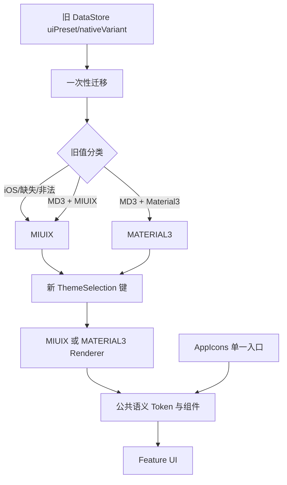

# 前端架构与主题精简优化计划

最后更新：2026-08-05  
状态：阶段 0-4、5a、5b、5d 已完成；阶段 5c、6、7 待完成  
事实基线：当前工作区源码与 `.trae/specs/audit-frontend-architecture-theme-simplification/review-report.md`  
相关文档：[架构说明](ARCHITECTURE.md) · [当前路线图](ROADMAP.md) · [主题规范](ui-design/03_THEMES.md) · [Miuix 对齐记录](MIUIX_ALIGNMENT.md)

## 当前实施进度

本节是计划的唯一进度入口；阶段定义和最终完成条件仍以本文后续章节为准。当前工作区已经完成主题选择模型、DataStore 单向迁移、Renderer 收敛、Cupertino 控件替换，以及 Cupertino/Miuix 图标直接调用的主要收敛。当前库存由 `scripts/theme_simplification_inventory.ps1` 于 2026-08-05 生成。

| 状态 | 模块 | 已验证结果或剩余原因 |
| --- | --- | --- |
| 已完成 | 阶段 0：基线和清单 | 可重复生成生产源码图标、主题枚举和旧键库存。 |
| 已完成 | 阶段 1：两值选择模型 | 设置 UI 仅展示 MIUIX/MATERIAL3，默认值为 MIUIX；迁移表和默认值策略测试已覆盖。 |
| 已完成 | 阶段 2：DataStore 单向迁移 | 使用 `theme_selection_v1`；单事务删除旧键；新键优先且重复启动幂等。 |
| 已完成 | 阶段 3：Renderer/API 收敛 | `PresetPrimitiveRenderer` 和语义视觉策略不再分发 iOS；Cupertino 图标族死代码已删除。 |
| 已完成 | 阶段 4：Cupertino 控件迁移 | Slider、Switch、ActivityIndicator 和下拉刷新已替换；生产源码仅保留首页底栏的 Cupertino 图标临时例外。 |
| 已完成 | 阶段 5a：AppIcons 入口收敛 | 语义函数已改为无主题分发的单一映射。 |
| 已完成 | 阶段 5b：Cupertino Icons 生产调用 | 生产源码 Cupertino import 只剩 `feature/home/components/BottomBar.kt` 的已登记临时例外。 |
| 已完成 | 阶段 5d：Miuix Icons 直接 import | 生产源码只剩 `BottomBar.kt` 和 `HomeNavigationIconPolicy.kt` 的已登记临时例外。 |
| 未完成 | 阶段 5c：Material Icons 迁移到 AppIcons | 仍有 131 个生产文件、671 个直接 import 命中（含 `AppIcons.kt` 实现层）。需先补齐语义映射，再按媒体、功能、长尾批次替换。 |
| 暂缓 | 阶段 5c 中的 MP3/音乐图标 | `MusicNote`、`Album`、`LibraryMusic` 及播放器控制图标尚无确认可用、语义和视觉均合格的 Miuix/项目矢量替代。为避免音乐库、专辑和播放控制误导用户，此范围保留 Material Icons，待替代资产确定并完成无障碍语义核验后再迁移。 |
| 未完成 | 阶段 6：依赖和死代码删除 | 受阶段 5c 及首页底栏临时例外阻塞，尚不能删除 Cupertino 和 `material-icons-extended` 依赖。 |
| 未完成 | 阶段 7：双主题回归和事实文档切换 | 等阶段 5c/6 完成后执行自动回归、必要设备检查，并更新 ARCHITECTURE、ROADMAP、主题规范、QA 和发布说明。 |

当前静态库存：Cupertino import 为 1 个文件/3 处，Miuix icon import 为 2 个文件/17 处，均限于首页底栏临时例外；Material Icons 为 131 个文件/671 处，未纳入本次已完成范围。

## 1. 目标

本计划以减少主题、图标、状态和导航的平行实现为目标，按可验证的小批次完成以下工作：

1. 删除 iOS 主题选择、Renderer、专属色板、形状、动效、文案、测试和持久化数据。
2. 将运行时主题收敛为 `MIUIX` 与 `MATERIAL3`，并以 **MIUIX 作为唯一默认主题**。
3. 删除全部 Compose Cupertino 控件与 Cupertino Icons 依赖。
4. 建立单一语义图标入口；MIUIX 与 MD3 共用同一套 Miuix 风格图标，不再维护按主题切换的图标集合。
5. 在不扩大重构范围的前提下，治理设置状态、直播搜索、字体 I/O、导航恢复和跨 feature UI 依赖。
6. 每一阶段均可独立编译、测试、回滚代码，不依赖一次性全仓改写。

## 2. 非目标

- 不新增独立 feature Gradle 模块。
- 不把现有分域 ViewModel 合并为新的巨型 ViewModel。
- 不因删除 iOS 主题而删除 Haze、Backdrop、液态玻璃、预测返回或其他跨主题能力。
- 不要求在本计划中重做首页底部导航栏图标资产；该资产工作可并行完成。
- 不支持新版本主题数据向旧版本代码降级兼容，不双写旧主题键。
- 不运行 debug/smooth APK 打包或安装任务；验证遵循仓库的编译、单测、lint 和必要手工设备检查规则。

## 3. 已确认决策

| 决策 | 结论 |
| --- | --- |
| 默认主题 | MIUIX |
| 新安装 | MIUIX |
| 旧 iOS 值 | 单向迁移为 MIUIX |
| 缺失或非法值 | 迁移为 MIUIX |
| 保留主题 | MIUIX、MATERIAL3 |
| 降级兼容 | 不支持；不双写旧键 |
| Cupertino 控件 | 全部删除 |
| Cupertino Icons | 全部删除 |
| Material Icons | 删除 feature 和 app 生产代码中的直接使用 |
| MD3 图标风格 | 与 MIUIX 共用统一的 Miuix 风格语义图标 |
| 首页底栏 | 迁移期间暂时保留当前成对图标引用；最终切换为项目自有 outlined/filled 资产 |

MD3 在目标架构中表示 Material 3 组件、颜色、形状和动效渲染器，但使用 BiliPai 统一的 Miuix 风格图标。这是有意的产品视觉规则，不要求保持纯 Material Icons 风格。

## 4. 优先级与工作流

审查发现不保留 P0。当前证据没有显示发布阻断、安全问题、数据丢失或必现崩溃。实施分为一条主题主线和三条可并行治理线。

| 工作流 | 优先级 | 内容 | 是否阻塞 iOS 删除 |
| --- | --- | --- | --- |
| A. 主题与依赖精简 | P1 | 选择模型、DataStore 迁移、Renderer、Cupertino、图标统一 | 是 |
| B. 运行时正确性 | P1 | 字体 I/O、Navigation3 恢复与状态回收、直播搜索状态 | 否 |
| C. 架构边界 | P2 | 设置页状态契约、视频详情 route/state、字符串路由适配器 | 否 |
| D. 低风险清理 | P3 | LazyColumn key、未使用 UseCase、未使用依赖、跨 feature UI | 否 |

主题主线不得等待 B/C/D 全部完成。非主题工作只能在写集互不冲突、验证范围明确时并行实施。

## 5. 目标主题架构



### 5.1 选择模型

- 直接演进现有主题选择模型，不再增加语义重复的第四套枚举。
- 最终输入域仅含 `MIUIX` 与 `MATERIAL3`。
- 枚举持久化使用稳定字符串，不依赖 ordinal 或声明顺序。
- `CompositionLocal`、主题函数、ViewModel 默认值、测试 fixture 和设置 UI 必须使用同一个 MIUIX 默认值。
- 业务 feature 不直接判断具体主题；差异进入设计系统 Renderer 或小型纯策略。

### 5.2 DataStore 单向迁移表

| 新键 | 旧 `UiPreset` | 旧 `AndroidNativeVariant` | 迁移结果 |
| --- | --- | --- | --- |
| MIUIX/MATERIAL3 | 任意 | 任意 | 保留新键，不被旧值覆盖 |
| 缺失 | iOS | 任意或缺失 | MIUIX |
| 缺失 | MD3 | MIUIX | MIUIX |
| 缺失 | MD3 | MATERIAL3 | MATERIAL3 |
| 缺失 | 缺失 | 任意或缺失 | MIUIX |
| 缺失 | 非法 | 任意或非法 | MIUIX |

迁移要求：

1. 在主题 Flow 对外发射前完成迁移，避免首帧先显示旧主题再切换。
2. 在一次 DataStore edit/migration 事务中写入新键并删除旧键。
3. 新键优先，重复启动不得覆盖用户在新版本中的选择。
4. 不双写旧键；迁移完成后运行时不得继续读取旧键。
5. 删除旧键、旧解析器和旧写入计划前，必须先有迁移表测试。
6. 文档明确不支持主题数据向旧代码降级兼容。

## 6. 统一语义图标架构

### 6.1 边界

`design-system` 提供唯一语义图标入口，feature 只表达图标语义，不选择图标库。建议按语义域分组，避免一个无边界的平铺对象：

```kotlin
AppIcons.Navigation.Back
AppIcons.Navigation.Home
AppIcons.Actions.Search
AppIcons.Actions.More
AppIcons.Media.Play
AppIcons.Media.Pause
AppIcons.Status.Warning
```

入口可以返回 `ImageVector`，业务继续使用现有 `AppIcon`/`Icon` 组件；不为每个图标再包装一个专用 Composable。

### 6.2 图标来源规则

1. 普通操作、媒体、状态和内容图标优先映射到 Miuix Icons。
2. Miuix Icons 缺失的语义使用项目内 Miuix 风格矢量资源，并登记缺口与替换原因。
3. MIUIX 与 MD3 使用同一映射，不按主题返回 Cupertino 或 Material 图标。
4. 最终生产源码禁止直接 import Cupertino Icons、Material Icons 和底层 Miuix Icons。
5. 底层 Miuix Icons 只允许在语义图标实现层使用。
6. 图标名称按业务语义命名，不暴露来源库名称。

### 6.3 首页底栏临时例外

首页导航需要可辨认的 outlined/filled 成对状态。当前代码同时存在：

- `BottomNavItem.selectedIcon/unselectedIcon` 中的 Cupertino 成对图标；
- `resolveMiuixPreferredHomeNavigationIcon` 中的 Miuix Regular/Medium 图标；
- 动态、Story、直播、游戏和听视频的本地矢量资源。

为加速版本迭代，迁移期间允许首页底栏继续使用当前成对图标引用，但必须满足以下边界：

1. 例外仅限首页底部导航栏，不扩散到侧栏、设置、播放器或其他 feature。
2. 不新增 Cupertino 图标种类或新的直接 import 文件。
3. 底栏继续保留 outlined/filled 交叉淡入淡出和选中态语义。
4. 项目自有成对矢量完成后，统一改由 `AppIcons.Navigation` 提供。
5. 当前 Cupertino 底栏引用清零是删除 Cupertino Icons 依赖的硬性退出条件。
6. 若复用第三方图形路径，必须先确认许可证；优先使用项目自有矢量资产。

### 6.4 静态门禁

在迁移完成前建立源码结构测试或现有静态检查，逐步收紧允许列表：

- 禁止新增 `io.github.alexzhirkevich.cupertino` import。
- 禁止新增 `androidx.compose.material.icons` import。
- 禁止 feature 新增 `top.yukonga.miuix.kmp.icon` import。
- 迁移完成后取消临时允许列表，要求生产源码零直接命中。

## 7. iOS 删除分期计划

### 阶段 0：冻结基线与清单

**工作**

- 记录实施起点 commit SHA、依赖版本和检索日期。
- 生成 Cupertino 控件、Cupertino Icons、Material Icons、`iOS*` 名称和主题旧键的生产调用清单。
- 将命中项分为：iOS 专属、通用能力历史命名、图标来源、测试/文档、可直接删除。
- 对图标按 feature 和语义域分批，记录是否存在 Miuix 等价项。

**退出条件**

- 清单可由命令重复生成。
- 每项有目标替代、归属批次和验证方式。
- 首页底栏临时允许列表被单独记录。

### 阶段 1：兼容测试与两值选择模型

**工作**

- 先新增迁移表和默认值测试。
- 将选择模型、设置选项和 Renderer 输入域准备为两值模型。
- 所有新建状态、缺失值和非法值默认 MIUIX。
- 暂不删除旧枚举和 Renderer，以保证迁移代码仍可解析历史数据。

**退出条件**

- iOS、缺失、非法、MIUIX、MATERIAL3、新键优先均有纯 Kotlin 测试。
- 设置 UI 只向用户展示 MIUIX 与 MATERIAL3。
- 代码仍能读取历史数据，但运行时选择结果不再产生 iOS。

**最小验证**

```text
./gradlew :design-system:testDebugUnitTest --tests '*UiPreset*'
./gradlew :app:testDebugUnitTest --tests '*Theme*'
./gradlew :app:compileDebugKotlin
```

### 阶段 2：DataStore 单向迁移

**工作**

- 引入新稳定键并执行一次性迁移。
- 新键优先；旧 iOS、缺失和非法值写入 MIUIX。
- 旧 MD3/MIUIX 组合保持其有效选择。
- 同一事务删除旧 `uiPreset`/`nativeVariant` 键。
- SettingsManager 运行时只暴露新的两值 Flow 和写入口。

**退出条件**

- 重复启动幂等。
- 不存在旧值导致的首帧 iOS 或主题闪切。
- 新版本中切换主题后不会重新生成旧键。
- DataStore 临时目录测试全部通过。

### 阶段 3：Renderer 与通用 API 中性化

**工作**

- Renderer 收敛为 MIUIX/MATERIAL3。
- 将确属通用能力的 iOS 历史名称改为中性名称。
- 保留 Haze、Backdrop、液态玻璃、预测返回、减弱动效和跨主题形状能力。
- 将真正 iOS 专属的颜色、连续圆角和弹簧策略标记为待删除，不再增加调用。
- 先提供等价 API，再迁移业务调用；不在调用仍存在时删除实现。

**退出条件**

- 新业务代码不引用 `UiPreset.IOS` 或 iOS Renderer。
- 两个 Renderer 均可独立通过 design-system 策略测试。
- 通用能力不再因历史名称被误删。

### 阶段 4：Cupertino 控件迁移

**建议批次**

1. `design-system` 和 `app/core/ui` 公共组件。
2. 设置、登录、弹窗、输入与选择控件。
3. 首页、动态、搜索、消息与列表状态。
4. 视频、番剧、直播、音频等交互密集页面。
5. 长尾页面、测试 fixture 和示例。

**替代原则**

- MIUIX renderer 优先使用 Miuix 组件。
- MATERIAL3 renderer 使用 Material3 组件，但图标仍来自统一 `AppIcons`。
- 业务状态和事件保持不变，不借控件替换重写 feature。
- 无等价组件时先进入中性 facade，不复制两份业务页面。

**退出条件**

- 生产源码零 Cupertino 控件调用；首页底栏临时图标例外可继续存在。
- 每批通过 `:app:compileDebugKotlin` 和对应目标测试。

### 阶段 5：图标统一

**建议批次**

1. 返回、搜索、更多、关闭、确认、警告等高频语义图标。
2. 播放、暂停、进度、音量、字幕、投屏等媒体图标。
3. 设置、账号、隐私、下载、消息等功能图标。
4. 长尾 Cupertino 图标。
5. 当前 Material Icons 直接调用。
6. 首页导航项目自有 outlined/filled 图标切换。

**退出条件**

- MIUIX 与 MD3 对同一语义返回同一图标。
- feature 零 Cupertino、Material、Miuix 图标库直接 import。
- 首页导航选中/未选中状态完整，未退化为仅 tint 或字重变化。
- 语义图标缺口清单归零，或每个保留缺口都有项目本地资产。

### 阶段 6：代码、依赖和资源删除

**严格顺序**

1. 确认所有生产调用、生成代码、测试和示例零引用。
2. 删除 iOS Renderer、专属色板、形状、动效和旧选择模型分支。
3. 删除旧主题键、解析器、写入计划和兼容 fixture。
4. 删除 iOS/Cupertino 文案和确认无引用的资源。
5. 删除 `cupertino-adaptive`。
6. 删除 Cupertino 控件与 Cupertino Icons 依赖。
7. 在 Material Icons 零直接调用后删除其不再需要的直接依赖。
8. 通过依赖报告确认最终解析图中没有意外保留项。

**退出条件**

- 生产源码和构建文件零 Cupertino 命中。
- 运行时主题模型零 iOS 值、分支和默认值。
- 生产 feature 零 Material Icons 直接 import。
- MIUIX、MATERIAL3 两种主题均可编译并通过目标测试。

### 阶段 7：双主题回归与文档切换

**自动验证**

```text
./gradlew :design-system:testDebugUnitTest
./gradlew :app:testDebugUnitTest
./gradlew :app:compileDebugKotlin
./gradlew :app:lintDebug
```

根据实际改动先运行目标测试，再逐级扩大，不默认执行 APK 打包。

**用户手工设备检查**

- MIUIX 与 MD3 的浅色、深色、AMOLED、动态色和自定义色。
- 手机、平板/大屏、横竖屏和系统字体缩放。
- 首页底栏每个图标的选中、未选中、切换动画、角标和自定义皮肤。
- 设置主题切换后页面状态不丢失，无 iOS 瞬时闪现。
- 视频、番剧、直播和音频的播放控制图标语义一致。
- 模糊关闭、低性能降级和减弱动效下仍可识别状态。

**文档切换**

- `ARCHITECTURE.md`：三主题边界改为双主题和统一图标入口。
- `ROADMAP.md`：三套视觉预设改为 MIUIX/MD3 双主题回归。
- `ui-design/03_THEMES.md`：标题、主题树、映射矩阵、示例和验收全部改为双主题。
- `ui-design/README.md`、页面档案和组件文档：移除 iOS 规范与旧三风格事实基线（现行基线为 MIUIX / Material 3 两主题）。
- `QA.md`：加入主题迁移、统一图标和底栏成对状态检查。
- 发布说明：明确历史 iOS 用户自动迁移到 MIUIX，iOS 主题入口已删除。

## 8. 架构治理计划

### 8.1 设置状态契约（P2）

- 不把 DataStore 直接订阅笼统描述为第二数据源；问题是页面同时依赖 ViewModel 和 Store 两种 UI 契约。
- 不继续扩大巨型 `SettingsUiState`。
- 按页面建立 `PlaybackSettingsUiState`、`SettingsRootUiState` 等子状态，并只在对应页面生命周期内订阅。
- ViewModel 暴露状态与事件；Composable 只保留焦点、弹窗开关、滚动等展示状态。

### 8.2 直播搜索（P1）

- 提取不可变搜索状态与 ViewModel。
- 查询提交取消旧请求，两个 tab 分别维护分页、错误和 hasMore。
- 使用 `SavedStateHandle` 保存查询词、tab 和已提交状态。
- 为首搜、重复项、并发加载更多、失败重试和取消建立纯 Kotlin 测试。

### 8.3 视频详情状态宿主（P2）

- route 层直接接收类型化详情 NavKey 或紧凑 `VideoDetailRouteArgs`。
- 保留播放、互动、评论、补充信息等现有分域 ViewModel。
- 分区内容消费对应 state/action，不建立新的巨型 ViewModel 或巨型状态对象。

### 8.4 字体 I/O（P1）

- 导入使用 IO dispatcher、临时文件、流式大小限制和成功后的原子替换。
- 无效、超限、取消和失败文件必须清理。
- 主题组合只消费已准备或缓存的字体结果，不同步查询 ContentResolver 或读取字体文件。
- ViewModel 不直接持有 Compose `FontFamily` 类型。

### 8.5 Navigation3（P1/P2）

- `BiliPaiNavKey` 是应用内权威路由模型，字符串只用于 Intent、插件和旧深链适配。
- 非法字符串不得静默回到 Home 或构造零值参数。
- 使用 Navigation3 官方保存 API 或显式 Saver 持久化可序列化 back stack。
- pop、replace、清栈后集中回收 `SaveableStateHolder` key；预测返回动画完成前不得提前删除。

### 8.6 低风险清理（P3）

- 为直播聊天消息建立真正唯一、稳定的 UI key；优先协议 ID 或入队时生成的本地 ID。
- 删除无生产引用的旧 `UserInteractionUseCase`。
- 同时复核两个 `SponsorBlockUseCase`；若插件链路已经完全替代，则两者均删除。
- `cupertino-adaptive` 可在独立变更中优先删除。
- 将 settings 对 home segmented control 的横向依赖收敛到已有 design-system 中性组件。

## 9. 提交与验证策略

每个阶段按小批次提交，避免把数据迁移、Renderer、图标和 feature 状态修改混入同一提交。

建议提交边界：

1. 测试与迁移契约。
2. 两值模型和 DataStore 迁移。
3. Renderer/API 中性化。
4. 每个 feature 的 Cupertino 控件替换。
5. 每个语义图标域的迁移。
6. 首页底栏图标切换。
7. iOS 代码与依赖删除。
8. 架构治理的独立批次。
9. 双主题回归修复和文档切换。

每批提交前至少执行最小目标测试和 `:app:compileDebugKotlin`；共享行为、导航或主题模型变化需要扩大到对应模块测试。发现 Gradle/Kotlin daemon 或增量状态错误时，按仓库规范切换到 `--no-daemon --no-configuration-cache` 的确定性验证路径。

## 10. 完成定义

只有同时满足以下条件，本计划才算完成：

- 用户只能选择 MIUIX 或 MATERIAL3，默认始终为 MIUIX。
- 历史 iOS、缺失和非法主题数据均幂等迁移为 MIUIX。
- 旧主题键不再读写并已删除。
- iOS Renderer、专属视觉实现、文案和测试已删除或改写。
- Cupertino 控件、Cupertino Icons 和 `cupertino-adaptive` 依赖已删除。
- 生产 feature 不直接引用 Cupertino、Material 或 Miuix 图标库。
- MD3 与 MIUIX 共用 `AppIcons` 语义映射。
- 首页底栏已切换到项目自有 outlined/filled 图标，不再依赖临时例外。
- 主题、图标、导航和字体相关自动验证通过。
- 用户完成必要的手机/平板双主题手工设备检查。
- 架构、路线图、主题规范、QA 和发布文档均已切换为双主题事实基线。
