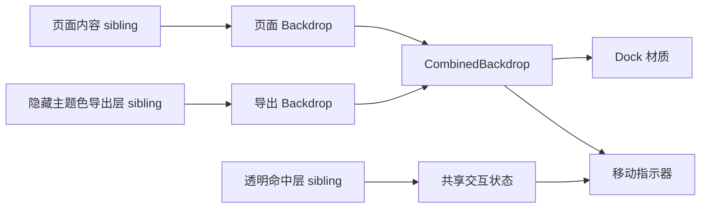

# 液态玻璃复用与首页底栏同源规范

最后更新：2026-07-30

## 目标与边界

全局“复用首页底栏液态玻璃”开启时，所有纳入复用的 Chrome 都必须调用首页浮动底栏的共享实现，不再各自调参或制作近似效果。页面可以保留原有高度、宽度、圆角布局和内容，但材质、指示器运动、采样拓扑、滚动响应及原本已有的显隐过渡必须与底栏同源。

全局开关关闭、平台不支持液态玻璃、视觉预算不足或页面处于不安全转场时，继续使用各页面原有的 MD3、iOS、模糊或纯色路径。卡片徽章、壁纸效果等非 Chrome 装饰不在本次复用范围内。

## 唯一参考实现

参考实现是当前首页浮动底栏的 Miuix/BiliPai 路径：

- Dock 使用现有 vibrancy、blur、24dp lens、容器色、阴影及边缘高光。
- 指示器使用 `BottomBarMotionProfile.ANDROID_NATIVE_FLOATING` 拖拽内核。
- 拖拽形变基准为 88/56；按压、速度拉伸、面板偏移、折射、主题色采样和释放回弹沿用底栏现值。
- 材质进入滚动态使用 140ms，退出滚动态使用 420ms。
- 纵向内容滚动只改变 Dock 材质的滚动态，不给指示器追加缩放、拉伸或折射。
- 可折叠 Dock 的显隐沿用底栏滑动、淡入淡出、进入 0.96、退出 0.92 及现有弹簧。顶部 Dock 只镜像运动方向和变换原点，不创造另一套参数。
- 分区纵向侧栏使用相同的指示器公式，仅交换主轴和交叉轴。

这些数值与公式属于实现事实，不是为其他页面重新设计的 token。共享组件必须直接消费底栏同一份策略、状态和渲染函数。

## 采样拓扑

Miuix 液态玻璃复用遵守以下 sibling/combined 拓扑：



- 页面内容、隐藏主题色导出层、液态 Dock/指示器和透明命中层必须是同级层。
- 没有外部页面 Backdrop 的内嵌控件，在控件背景之后建立局部 sibling capture，再与隐藏导出层组合。
- 禁止在目标控件或包含目标控件的父层上建立被目标控件消费的 `LayerBackdrop`，避免采样包含自身。
- 禁止在复用入口临时创建纯色“仿玻璃”来替代真实 backdrop。
- 该拓扑是 HyperOS 安全约束：用于防止 RenderNode/RenderThread 栈溢出、黑边、黑色鼓包、切页闪回和主题色采样延迟。

## 共享 API 约定

共享实现位于 `feature/home/components/BottomBarMatchedLiquidChrome.kt`：

- `BottomBarMatchedLiquidDock`：任意 Dock、搜索、评论或操作内容的材质壳层。
- `BottomBarMatchedLiquidIndicator`：承载文字、图标、角标和命中内容的移动指示器。
- `BottomBarMatchedLiquidChromeState` / `rememberBottomBarMatchedLiquidChromeState`：统一位置、速度、拖拽、按压、回弹及滚动态。
- `BottomBarLiquidOrientation`：水平选择和纵向侧栏共享主轴公式。
- `BottomBarMatchedDockVisibility`：为原本支持折叠或显隐的顶部/底部 Dock 提供同源过渡。

帧级位置、速度和滚动值以 provider/state 传递，并在布局或绘制阶段读取。业务选中项、可用状态和页面数据仍归页面或 ViewModel 所有。

## 迁移前差异

实施前存在以下已知偏差：

- 首页顶部 Dock 未继续传递列表滚动态。
- 首页顶部移动指示器部分路径硬编码 `BILIPAI_TUNED`，没有使用当前底栏预设。
- 通用分段控件混用 Kyant、Miuix 和无真实 backdrop 的静态壳层。
- 动态页顶部曾明确暂时退出复用。
- 视频详情底部评论/操作栏只复用了静态外壳，没有复用完整按压、滚动材质和采样状态。
- 多个页面自行持有 lens、scale、spring 或滑动偏移，造成同名“复用”但视觉不同源。

## 覆盖矩阵

| 范围 | Dock 材质 | 指示器/形变 | 滚动态 | 显隐 | 备注 |
|---|---:|---:|---:|---:|---|
| 首页底部导航 | 参考 | 参考 | 是 | 是 | 唯一基线 |
| 首页顶部标签/搜索/头像/边缘胶囊 | 同源 | 同源 | 首页列表 | 原有可折叠项 | 保留现有几何 |
| 动态顶部标签 | 同源 | Pager 实时跟随 | 当前列表 | 顶部镜像 | 重新纳入复用 |
| 全局及通用列表搜索 | 同源 | 按压状态 | 最近列表或 idle | 原有可折叠项 | 无外部 backdrop 时局部 sibling capture |
| 全部分段选择 | 同源 | 拖拽、甩动、Pager 跟随 | 关联内容或 idle | 常驻 | 保留各自宽高 |
| 分区纵向侧栏 | 同源 | 纵向主轴 | 关联列表 | 常驻 | 仅交换运动轴 |
| 视频详情评论/操作底栏 | 同源 | 按压状态 | 详情滚动 | 原有行为 | 不改业务动作 |

“全部分段选择”包括设置项、首页热门/今日看、历史、收藏、个人页、空间、视频简介与评论、评论排序、音频、直播、番剧及插件入口。

## 降级规则

- `androidNativeLiquidGlassEnabled == false`：保持原页面渲染路径，不调用共享 Miuix Chrome。
- Android 或渲染后端不支持：沿用现有平台能力判断和降级材质。
- 低视觉预算：沿用底栏预算策略，不由页面单独降低或放大参数。
- 转场期间：沿用已有安全门控，不能为了显示液态玻璃采样即将销毁或尚未稳定的树。
- 静态内容：显式传入 idle 滚动态；不推测不存在的滚动交互。

## 验收标准

策略与结构测试必须锁定：

- `ANDROID_NATIVE_FLOATING` motion profile。
- 88/56 拖拽形变、现有速度系数、面板偏移和回弹。
- Dock 24dp capture lens 与指示器现有 lens 参数。
- 140ms 进入滚动态、420ms 退出滚动态。
- 纵向滚动不改变指示器形变。
- 全局复用入口只调用共享实现；禁止在入口自研 lens、scale、spring、Kyant 指示器或自采样 backdrop。
- 动态顶部必须纳入复用。

交互验收覆盖点击切换、慢拖、快速甩动、边缘过拖、释放回弹、Pager 实时跟随、纵向侧栏、单项和禁用状态、长文本、明暗主题及紧凑尺寸。

兼容验收覆盖全局开关关闭、平台不支持、低视觉预算、转场期间以及缺失外部 backdrop 的局部 sibling capture。HyperOS 重点确认无 RenderThread 栈溢出、黑带、黑色鼓包、主题色延迟、切页闪回原始画面和指示器裁切。

## 验证命令

```bash
./gradlew :app:testDebugUnitTest --tests '<相关策略或结构测试>' --no-daemon --no-configuration-cache --console=plain
./gradlew :app:compileDebugKotlin --no-daemon --no-configuration-cache --console=plain
./gradlew :app:testDebugUnitTest --no-daemon --no-configuration-cache --console=plain
```

本规范不授权 APK 打包、安装、release smoke 或设备视觉验收；这些步骤需要单独明确授权。
