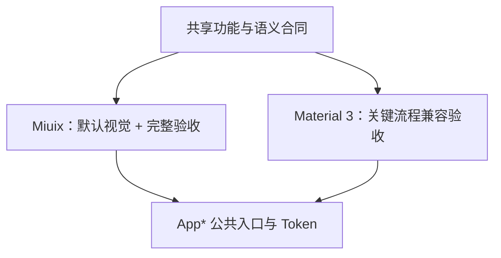

# 01 设计方向

> 文档编号：UI-01  
> 规范版本：1.1.0-draft  
> 状态：草案  
> 最后核对日期：2026-08-31  
> 适用提交：4443e72ff  
> 维护角色：设计系统维护者  
> 相关文档：[主题规范](03_THEMES.md) · [Miuix 对齐记录](../MIUIX_ALIGNMENT.md)

## 初学者解释

“Miuix 主导”指默认界面的视觉气质、控件选择和完整测试以 Miuix 为准，Material 3 保持独立渲染；iOS 仅是历史设置迁移来源。两种预设像同一间房的两套装修：家具样式可以不同，但门的位置、房间用途和逃生通道不能改变。

## What：设计目标

BiliPai 是内容浏览和媒体播放工具，界面应该安静、清晰、适合反复操作。目标优先级如下：

1. 用户能看懂当前内容和可执行操作。
2. 加载、失败、权限、登录与播放状态诚实可见。
3. 手机、平板和宽屏保持同一信息顺序。
4. Miuix 具有完整一致的外观，Material 3 保持功能兼容。
5. 动效和玻璃效果服务于层级反馈，不能牺牲可读性与性能。

## Why：为什么这样选择

- 项目已经接入 Miuix 0.9.4-4f86de92-SNAPSHOT，并已有主题桥接、Preference、导航栏、侧栏和播放器设置等能力。
- 运行时只使用 `AppUiStyle.MIUIX` 和 `AppUiStyle.MATERIAL3`，保留历史设置迁移，不新增风格枚举。
- 页面数量较多，若每种风格各设计一套信息架构，维护成本会近似变成三倍并容易产生功能差异。

## How：共同合同与允许差异

| 项目 | 双预设必须一致 | 可以不同 |
|---|---|---|
| 功能 | 可执行操作、启用条件、结果 | 控件底层实现 |
| 信息 | 内容字段、重要性顺序、错误原因 | 字体细节、间距微调 |
| 状态 | 加载、空、失败、离线、登录、权限 | 指示器和容器外观 |
| 导航 | 入口、返回结果、深链含义 | 转场曲线、导航栏造型 |
| 无障碍 | 名称、角色、状态、顺序、48dp 触摸区 | 聚焦视觉反馈 |
| 品牌 | BiliPai/Bilibili 业务含义 | 主题角色色的具体映射 |



## 规范要求

- **必须**以 Miuix 作为新功能的默认视觉设计与完整验收路径。
- **必须**保留 Material 3 的功能、信息、状态、导航和无障碍语义。
- **必须**从 `App*` 公共入口消费风格差异；业务页面不得直接读取 Miuix 主题对象。
- **应该**先定义语义组件，再决定双预设分别由哪个底层组件渲染。
- **可以**让不同风格使用各自适合的圆角、字重、反馈和动效。
- **禁止**为了视觉一致而伪装平台控件，也禁止因风格不同隐藏某项功能。

## 正确与错误示例

正确：两种预设的“关注”都显示已关注/未关注状态，Miuix 使用 Miuix 按钮，Material 3 使用 Material 按钮。  
错误：Miuix 有取消关注入口，而另一预设只能关注不能取消。

正确：平板把列表与详情并排，但阅读顺序仍是列表选择后查看详情。  
错误：宽屏新增只有平板才能找到的核心操作。

## Compose 短示例

```kotlin
// 业务层只描述“主操作”，具体皮肤由设计系统决定。
AppButton(onClick = onConfirm, enabled = canConfirm) {
    AppText("确认")
}
```

## 代码映射

- 风格设置：应用侧 `AppUiStyle.MATERIAL3`、`AppUiStyle.MIUIX`
- 设计系统预设：`UiPreset.kt`、`PresetPrimitiveRenderer.kt`
- 公共原语：`AppPrimitiveComponents.kt`
- 当前 Miuix 技术接入事实：[MIUIX_ALIGNMENT.md](../MIUIX_ALIGNMENT.md)

## 当前差距

部分 feature 文件仍直接使用特定库组件或局部硬编码外观；多个同名业务组件尚未统一语义入口。兼容风格目前也没有与 Miuix 同等规模的自动化与人工矩阵。

## 验收方法

选首页、搜索、视频详情/播放器、个人页、设置和通用弹层，切换两种预设。每项功能入口、状态文案、返回结果和可访问名称必须一致；只允许外观和反馈方式发生本节允许的变化。

