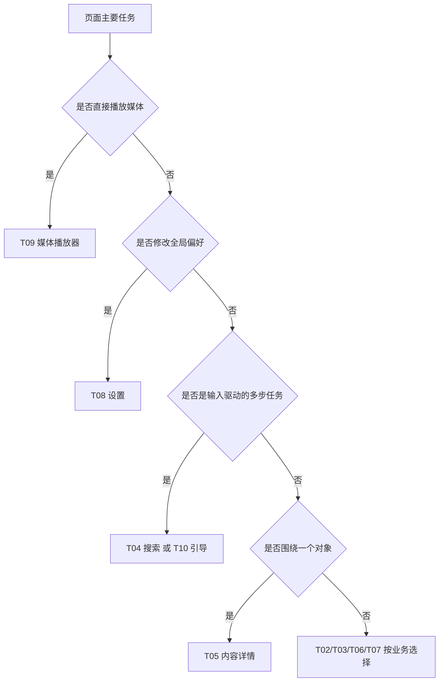

# 08 页面母版

> 文档编号：UI-08  
> 规范版本：1.1.0-draft  
> 状态：草案  
> 最后核对日期：2026-08-31  
> 适用提交：4443e72ff  
> 维护角色：设计系统维护者  
> 相关文档：[布局与自适应](05_LAYOUT_ADAPTIVE.md) · [页面目录](pages/PAGE_CATALOG.md)

## 初学者解释

页面母版是一类页面的共同骨架，不是可以直接复制的成品页面。母版解决顶部栏、主要内容、状态、返回和宽屏重排；具体页面再填入视频、消息或设置等业务内容。这样“搜索结果”和“历史记录”都能复用列表规律，又不会被强行做成完全一样。

## 固定状态合同

每个页面档案必须逐项说明下表。没有该状态时写“不适用 + 原因”，不能留空。

| 状态 | 页面必须回答的问题 | 默认表现 |
|---|---|---|
| 首次加载 | 用户是否知道正在加载什么 | 稳定占位或明确进度，不闪空状态 |
| 刷新 | 旧内容是否保留 | 保留可用内容并显示局部进度 |
| 正常 | 主任务是什么 | 内容和主要操作清晰 |
| 部分数据 | 哪些信息缺失 | 展示可用内容，局部说明缺失 |
| 空内容 | 是没有数据还是筛选无结果 | 解释原因并给出下一步 |
| 失败 | 失败范围与恢复方式 | 可读原因、重试或返回 |
| 离线 | 可用缓存和受限功能是什么 | 不伪装成功，不清空可用缓存 |
| 未登录 | 能看什么、登录后增加什么 | 登录入口，不把未登录当网络错误 |
| 权限不足 | 为什么需要权限 | 解释用途、拒绝后降级、设置入口 |
| 禁用 | 为什么当前不可操作 | 可见状态与原因，不响应点击 |
| 分页加载 | 是否还有旧内容 | 列表尾部轻量进度，不遮挡整页 |
| 分页结束 | 用户是否知道已到底 | 稳定结束状态，避免无限请求 |

## 规范要求

### T01 应用外壳

**What**：承载全局主题、主导航、顶部区域、迷你播放器和 Navigation 3 内容的根容器。  
**Why**：系统栏、底栏和跨页面播放状态必须只有一个所有者。  
**How**：`MainHost` 使用 `AppScaffold`/自适应导航；Compact 使用底部导航，Expanded 可使用 Rail/Sidebar。内容 inset 只计算一次。

文字线框：

```text
┌────────────────────────────┐
│ 可选全局顶部区域           │
├──────┬─────────────────────┤
│ Rail │ 当前主目的地        │
│ 或   │                     │
│ 底栏 │                     │
├──────┴─────────────────────┤
│ 可选迷你播放器             │
└────────────────────────────┘
```

### T02 信息流

**What**：连续浏览推荐、动态或分类内容的列表/网格。  
**Why**：滚动稳定性和占位体验决定高频浏览是否顺畅。  
**How**：列表使用稳定 key，刷新保留旧内容，卡片比例固定；Compact 单列/双列按业务，Expanded 增加列数而非无限拉伸卡片。

### T03 列表管理

**What**：历史、收藏、稍后再看、下载等可管理集合。  
**Why**：删除和批量操作具有数据风险。  
**How**：正常浏览与选择模式分离；删除明确对象与影响；批量操作有退出方式；空状态区分“没有数据”和“筛选无结果”。

### T04 搜索发现

**What**：输入查询、查看建议、热榜和结果。  
**Why**：输入、历史、筛选和结果是连续任务。  
**How**：搜索框保持焦点和查询；结果按类型切换；宽屏可将筛选与结果并排；清空按钮、提交和系统返回行为明确。

### T05 内容详情

**What**：视频、文章、动态、专题、合集等单个对象的完整信息。  
**Why**：详情连接消费、互动与继续发现。  
**How**：主要内容在前，作者与互动紧随，评论/推荐在后；局部失败不能遮掉已经可用的主体；返回恢复来源列表。

### T06 个人空间

**What**：当前用户或其他用户的身份、统计和内容分区。  
**Why**：本人管理动作与访问他人空间的动作不同。  
**How**：身份区、关系操作和内容区分层；登录/权限状态明确；宽屏可固定身份摘要并显示内容区。

### T07 消息会话

**What**：消息中心、分类消息和聊天。  
**Why**：未读状态、时间顺序和隐私要保持可信。  
**How**：消息中心先分类后内容；聊天按时间顺序，发送状态可见；宽屏可列表-会话双栏；离线不伪装发送成功。

### T08 设置

**What**：可搜索、分组、持久化的选项与工具入口。  
**Why**：设置会改变全局行为，错误映射会造成难以发现的问题。  
**How**：使用 `AppPreference*`；标题描述开启后的状态；危险操作独立分组；840dp 起可目录-详情双栏；搜索结果返回准确设置项。

### T09 媒体播放器

**What**：视频、番剧、直播、离线和音频播放界面。  
**Why**：播放 surface、手势、控制层、生命周期和系统媒体状态高度耦合。  
**How**：媒体区域具有稳定宽高比；控制层不遮挡关键信息；加载/缓冲/失败可区分；全屏、PiP、后台与返回所有权明确；1600dp 特例只用于媒体布局。

### T10 引导与任务流

**What**：登录、首次引导、备份恢复、导入插件等有起止步骤的流程。  
**Why**：用户需要知道进度、风险和能否返回。  
**How**：每步只突出一个主要决定；显示当前目标与错误恢复；敏感信息不进入普通日志；退出时说明是否保留进度。

## 母版选择决策



## Compose 短示例

```kotlin
AppScaffold(topBar = { AppTopBar(title = { AppText(title) }) }) { padding ->
    when (uiState) {
        UiState.Loading -> LoadingState(Modifier.padding(padding))
        UiState.Empty -> EmptyState(onAction = onRefresh)
        is UiState.Error -> ErrorState(onRetry = onRefresh)
        is UiState.Content -> Content(uiState.items)
    }
}
```

## 代码映射

- 页面外壳：`AppScaffold`、`AppTopBar`
- 自适应分栏：`AppAdaptiveSplitLayout`
- 页面 Key：`BiliPaiNavKey.kt`
- 页面职责映射：`BiliPaiNavEntryContentPolicy.kt`
- 各 Key 的唯一归档：[PAGE_CATALOG.md](pages/PAGE_CATALOG.md)

## 当前差距

页面状态模型尚未使用同一类型；某些页面用整页错误覆盖可用内容，另一些页面没有显式离线或部分数据状态。母版是目标合同，不表示所有 Screen 已迁移。

## 验收方法

对每个页面先核对母版是否正确，再按固定状态合同逐项操作或通过测试状态注入。检查 Compact 与 Expanded 的信息顺序、返回结果、滚动位置和触摸目标，不使用截图作为完成证据。

